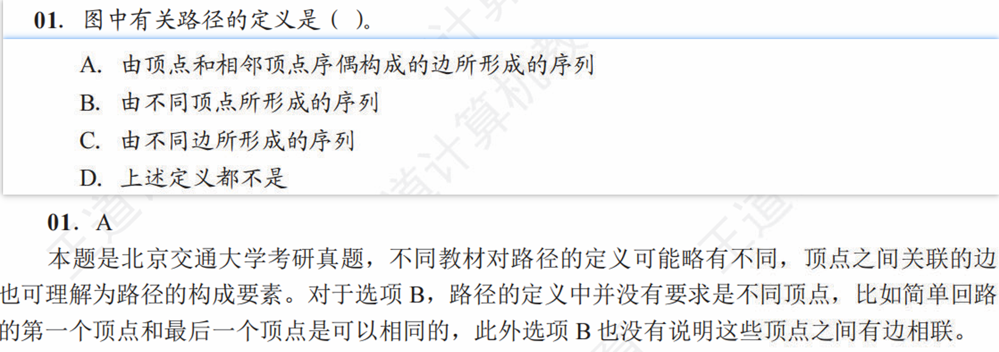

# 数据结构-图-问题解析汇总

## 路径定义

**题面及解析**

### A选项分析：由顶点和相邻顶点序偶构成的边所形成的序列

这个选项虽然表述非常学术化和拗口，但它是对“路径”这个概念最严谨、最全面的定义。我们来把它拆解开理解：

1. **“相邻顶点序偶”**：
    * 在图论中，一条边连接了两个顶点，比如 `v_i` 和 `v_j`。
    * “序偶” `(v_i, v_j)` 意味着顺序是重要的，它精确地定义了一条从 `v_i` 指向 `v_j` 的有向边（对于无向图，`(v_i, v_j)` 和 `(v_j, v_i)` 通常表示同一条边）。
    * 所以，“相邻顶点序偶构成的边”指的就是图中的**边**。

2. **“……所形成的序列”**：
    * 这句话指明了路径是一个由“边”组成的**序列**。这强调了路径的**方向性**和**顺序性**。例如，`边1 -> 边2 -> 边3` 和 `边3 -> 边2 -> 边1` 是两条不同的路径。

3. **“由顶点和……”**：
    * 这部分是关键，它确保了整个序列是**连通**的。它隐含的意思是，这个边的序列必须是首尾相连的，即前一条边的终点必须是后一条边的起点。
    * 例如，序列 `(v1, v2), (v2, v3), (v3, v4)` 是一个合法的路径。而 `(v1, v2), (v3, v4)` 就不是一条路径，因为它在 `v2` 和 `v3` 之间断开了。

**结论**：
选项A通过这种形式化的语言，同时定义了路径的三个核心要素：

* **构成元素**：顶点和边。
* **顺序性**：是一个序列。
* **连通性**：边与边之间必须通过顶点首尾相连。

因此，尽管它读起来有些奇怪，但它是所有选项中对“路径”描述最准确、最没有歧义的一个。
