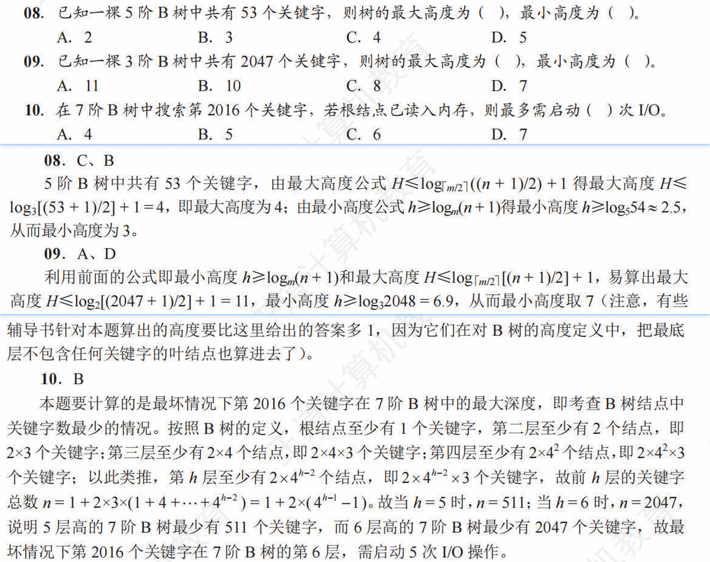
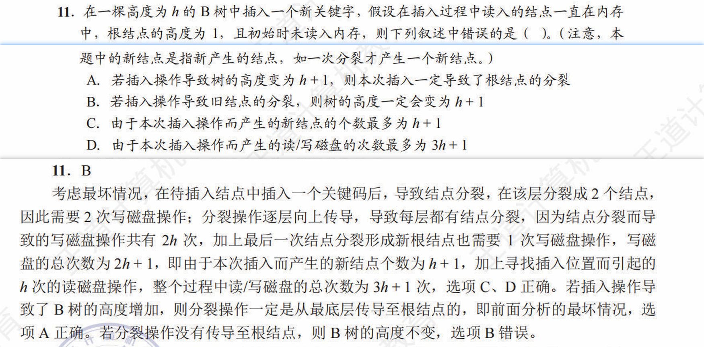
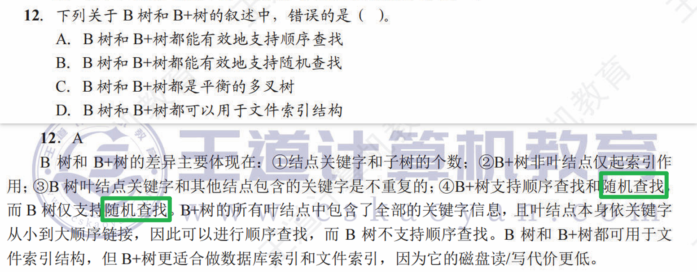

# 数据结构-查找-问题解析汇总

## B 树的高度分析

**题目及解析**

**已知全局，求树高(for t8-t9)**
若已知 m 阶 B 树中总的关键字个数 n，对于该树的 **最大高度 H** 的求解，必定是在最小分支数（即每个结点所含关键字数最少）的前提下得到，利用高度变量值 hx 表示在该前提下，该 B 树的关键字总数 x，此时 **x 值标定了 n 值的下限**，反解得到关于 hx 的不等式，取边界值为最大高度 H

$$
x(hx, m) \leq n
$$

若已知 m 阶 B 树中总的关键字个数 n，对于该树的 **最小高度 h** 的求解，必定是在最大分支数（即每个结点所含关键字数最多）的前提下得到，利用高度变量值 hx 表示在该前提下，该 B 树的关键字总数 x，此时 **x 值标定了 n 值的上限**，反解得到关于 hx 的不等式，取边界值为最大高度 h

$$
x(hx, m) \geq n
$$

**已知局部，求树高(for t10)**
若已知在 m 阶 B 树中所要查找的关键字序数值 n，这是一个局部的概念，该 B 树种含有的关键字总数的下限为 n，对于 **本次查找的最大深度** 的求解，必定是在最小分支数（即每个结点所含关键字数最少）的前提下得到，利用高度变量值 hx 表示在该前提下，该 B 树的关键字总数 x，此时 **n 值标定了 x 值的下限**，反解得到关于 hx 的不等式，取边界值为本次查找的最大深度

$$
x(hx, m) \geq n
$$

## B 树插入操作的读写磁盘分析

**题目及解析**

在 B 树中插入结点 **可能** 导致结点的分裂，随着结点中间值的提升、结点的分裂 **可能** 导致树高 + 1

插入结点必然是在终端结点插入，该操作一定是从根结点出发，一路向下。原先树高为 h，则 **读** 磁盘次数为 h

插入后，调整的 **最坏情况** 下，一路向上，最终导致根结点分裂。分裂过后的数据或新产生的结点数据，必然会触发一次写磁盘操作，原先每层会分裂产生一个平级的新结点，根结点分裂后产生了一个新的根结点。原先树高为 h，由于本次插入操作而产生的 **新结点个数** 为 h + 1，且由于本次插入操作而产生的 **读/写磁盘次数最多** 为 3h + 1（其中读磁盘 h 次，写磁盘 2n + 1 次）

## B 树与 B+ 树的比较

**题目及解析**

**多路查找** 亦称 **随机查找**
一般对于某个具体的 B 树图形，并 **不能** 确定其是几阶 B 树
