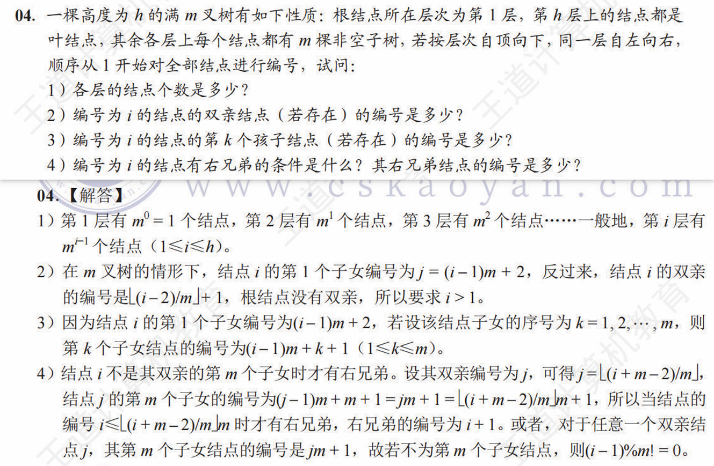

# 数据结构树与二叉树问题解析汇总

## 满 m 叉树的结论分析

**题面及解析**

**求节点 `j` 的子结点编号的详细分析**
在 m 满叉树的情形下，节点 `j` 前共有 $j - 1$ 个结点，此 $j - 1$ 个结点所展开的 $(j - 1)m$ 个结点均在结点 `j` 所展开的结点之前。所以，在节点 `j` 的第一个子结点之前，共有 $(j - 1)m + 1$ 个结点，其中 $1$ 表示根结点。

结点 `j` 的第一个子结点编号为 $(j - 1)m + 1 + 1$（即 $(j - 1)m + 2$），结点 `j` 的最后一个子结点编号为 $(j - 1)m + 1 + m$（即 $jm + 1$）

子结点编号通式
$$ (j - 1)m + 1 + k, \  k \in [1, m] $$

**求节点 `i` 的父结点编号详细分析**
子结点编号通式
$$ i = (j - 1)m + 2 + \theta, \ \theta \in [0, m - 1] $$

反解父结点编号
$$ \lfloor (i - 2) / m \rfloor = j - 1 $$
即
$$ j = \lfloor (i - 2) / m \rfloor + 1 $$
