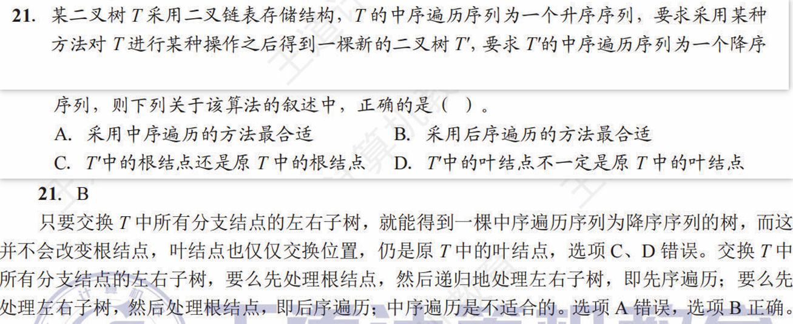

# 数据结构-树与二叉树-问题解析汇总

## 满 m 叉树的结论分析

**题面及解析**

**求节点 `j` 的子结点编号的详细分析**
在 m 满叉树的情形下，节点 `j` 前共有 $j - 1$ 个结点，此 $j - 1$ 个结点所展开的 $(j - 1)m$ 个结点均在结点 `j` 所展开的结点之前。所以，在节点 `j` 的第一个子结点之前，共有 $(j - 1)m + 1$ 个结点，其中 $1$ 表示根结点。

结点 `j` 的第一个子结点编号为 $(j - 1)m + 1 + 1$（即 $(j - 1)m + 2$），结点 `j` 的最后一个子结点编号为 $(j - 1)m + 1 + m$（即 $jm + 1$）

子结点编号通式
$$ (j - 1)m + 1 + k, \  k \in [1, m] $$

**求节点 `i` 的父结点编号详细分析**
子结点编号通式
$$ i = (j - 1)m + 2 + \theta, \ \theta \in [0, m - 1] $$

反解父结点编号
$$ \lfloor (i - 2) / m \rfloor = j - 1 $$
即
$$ j = \lfloor (i - 2) / m \rfloor + 1 $$

---

## 二叉搜索树升序、降序转换

**题面及解析**

**🎯 目标**：将一棵中序遍历为 **升序** 的二叉树 `T` (即二叉搜索树)，转换为一棵中序遍历为 **降序** 的新树 `T'`。

**🛠️ 核心操作**：要实现这个目标，最直接的方法就是 **递归地交换树中每一个节点的左、右孩子指针**。

### 各种遍历方法的适用性分析

#### 👎 中序遍历 (左 → 根 → 右) - 不可行

* **流程**：当处理完一个节点的 `左` 子树后，回到 `根` 节点并交换其左右孩子。
* **问题**：此时，原来的右子树已经变成了新的左子树。如果算法接下来按计划访问 `右` 子树，实际上会错误地访问到已经被处理过的、原来的左子树，导致逻辑混乱或死循环。

#### 👍 后序遍历 (左 → 右 → 根) - 可行 (最合适)

* **流程**：先递归地将 `左`、`右` 两个子树内部完全转换好，最后再处理 `根` 节点，交换它的左右孩子。
* **优势**：这是一个 **自下而上** 的过程。当处理一个节点时，它的子孙节点都已转换完毕，操作清晰，不会产生冲突。

#### 👍 前序遍历 (根 → 左 → 右) - 可行

* **流程**：先在 `根` 节点处交换左右孩子，然后再分别对 **新的** `左`、`右` 子树进行递归处理。
* **优势**：这是一个 **自上而下** 的过程。每个子树在被递归调用时，都可以被看作一个全新的、独立的问题，同样能保证逻辑的正确性。

### 结论

要完成题目要求的转换，算法需要遍历树中的每一个节点并执行交换操作。**后序遍历** 和 **前序遍历** 都能提供清晰、无冲突的递归逻辑来实现这一目标，因此都是合适的算法。而中序遍历的“夹心”结构使其在执行此特定任务时会产生逻辑错误。

---

## 二叉树遍历与栈操作的类比总结

**题面及解析**

### 📌 核心结论

二叉树的遍历序列问题，在特定组合下可以巧妙地转化为经典的**栈操作问题**。一个序列作为入栈顺序，另一个序列作为出栈顺序，其可能的组合数决定了二叉树的可能结构数。

### ✅ 成立的两种类比

1. **先序序列为入栈顺序，中序序列为出栈顺序**
    * **理由**：
        * **入栈 (Push)**：对应在**先序遍历**中访问到一个节点（根 → 左 → 右）。我们按顺序“发现”节点。
        * **出栈 (Pop)**：对应在**中序遍历**中访问到一个节点（左 → 根 → 右）。一个节点只有在其整个左子树都“出栈”后，它自己才能“出栈”。
    * **关系**：这种 *先发现，后处理左子树，再处理自己* 的模式，完美契合了栈的“后进先出”(LIFO) 原则。

2. **中序序列为入栈顺序，后序序列为出栈顺序**
    * **理由**：
        * **入栈 (Push)**：对应在**中序遍历**中访问到一个节点（左 → 根 → 右）。
        * **出栈 (Pop)**：对应在**后序遍历**中访问到一个节点（左 → 右 → 根）。一个节点必须等到其**左、右子树**都完全“出栈”后，才能轮到它自己。
    * **关系**：这可以看作是第一种情况的“镜像”问题，同样与栈的 LIFO 模型匹配。

### 🔢 与卡特兰数 (Catalan Number) 的关系

对于一个包含 `n` 个不同元素的序列，其所有可能的合法出栈序列的数量，恰好由**卡特兰数**给出。

* **公式**: $C_n = \frac{1}{n+1} C_{2n}^{n}$
* **应用**: 因此，一个包含 `n` 个节点的二叉树，其不同结构的个数就是第 `n` 个卡特兰数。例如，对于4个节点，可能的二叉树结构有 $C_4 = 14$ 种。

### ❌ 不成立的类比

* **后序序列为入栈顺序，前序序列为出栈顺序**
  * **理由**：这种类比**不成立**，因为它从根本上违反了栈的“后进先出”原则。
  * **核心矛盾**：
    * **入栈**：按后序（左 → 右 → 根），**根节点**是**最后一个**入栈的。
    * **出栈**：按前序（根 → 左 → 右），**根节点**必须是**第一个**出栈的。
  * **结论**：根据 LIFO 原则，只有当栈里仅有一个元素时，“最后进”才可能“最先出”。对于任何多于一个节点的树，该模型都会在根节点之外的第二个节点出栈时失败，因为栈顶元素将不是前序序列所期望的下一个元素。

---

## 并查集 Union 优化证明：为何树高不超过 O(log n)

**🎯 目标**：证明在并查集中，采用“按数量合并”（小树合并到大树）的 `Union` 操作后，任意树的高度 `H` 不会超过 $\lfloor \log_2 n \rfloor + 1$，其中 `n` 是总结点数。

### 核心性质与证明思路

证明这个结论的关键，在于先证明一个更强的引理（lemma）：

> **引理**：如果一个节点 `x` 的高度为 `h`（根节点高度为1），那么以 `x` 为根的子树至少包含 $2^{h-1}$ 个节点。

一旦此引理被证明，结论便可水到渠成。假设一棵包含 `n` 个节点的树，其最大高度为 `H`。那么根据引理，这棵树的总结点数 `n` 必须满足：

$$ n \ge 2^{H-1} $$

对这个不等式两边取以 2 为底的对数：

$$ \log_2 n \ge H-1 $$

移项后得到：

$$ H \le \log_2 n + 1 $$

因为高度 `H` 必须是整数，所以我们对其进行下取整：

$$ H \le \lfloor \log_2 n \rfloor + 1 $$

这样，便将问题转化为了证明上述的核心引理。

### 证明核心引理：数学归纳法

我们将使用**数学归纳法**来证明：“高度为 `h` 的节点，其子树大小至少为 $2^{h-1}$”。

**1. 基础情况 (Base Case):**

* 当高度 `h = 1` 时，节点是树中的叶子节点或一个孤立的根。它自己构成一棵子树，节点数量为1。
* 根据公式，其节点数至少为 $2^{1-1} = 2^0 = 1$。
* $1 \ge 1$，因此基础情况成立。

**2. 归纳假设 (Inductive Hypothesis):**

* 我们假设对于所有高度 $k < h$ 的节点，该性质都成立。即：任何高度为 `k` 的节点，其子树大小至少为 $2^{k-1}$。

**3. 归纳步骤 (Inductive Step):**

* 现在，我们考虑一个高度恰好变为 `h` 的节点 `x`。
* 节点 `x` 的高度增加，只可能发生在一次 `Union` 操作中。并且，只有在**两棵高度相同的树合并时**，根节点的高度才会加 1。
* 假设在某次合并前，树 $T_x$（以 `x` 为根）和树 $T_y$（以 `y` 为根）的高度都是 `h-1`。
* 根据**按数量合并**的规则（小树合并到大树），我们总是将节点数较少的树合并到节点数较多的树上。为了让 `x` 的高度增加，`y` 必须合并到 `x` 上。
* 根据我们的**归纳假设**，在合并前：
  * $T_x$ 的节点数 `size(x)` $\ge 2^{(h-1)-1} = 2^{h-2}$。
  * $T_y$ 的节点数 `size(y)` $\ge 2^{(h-1)-1} = 2^{h-2}$。
* 当 $T_y$ 合并到 $T_x$ 上后，形成了一棵新的、以 `x` 为根的树。其高度变为 `h`。
* 这棵新树的总节点数 = `size(x) + size(y)`。
* 新树的节点数至少为 $2^{h-2} + 2^{h-2} = 2 \times 2^{h-2} = 2^{h-1}$。
* 我们成功证明了：当节点 `x` 的高度达到 `h` 时，其子树的节点数至少为 $2^{h-1}$。归纳步骤完成。

### 最终结论

通过数学归纳法，我们证明了核心引理。由此可以严谨地得出，采用“按数量合并”优化的并查集，其树高 `H` 的上界为 $O(\log n)$，具体为 $\lfloor \log_2 n \rfloor + 1$。

## 树/森林与二叉树的转换关系总结

**题面及解析**

二叉树中 **左指针为空** 的结点个数 = 原树/森林中 **叶子结点** 的个数

二叉树中 **右指针为空** 的结点个数 = 1 + 所有作为其父结点最后一个孩子的非根结点

`p176-t8` 中给定了 **森林** `F` 有 `n` 个非终端结点，转换成二叉树 `B` 后，右指针域为空的结点有 `n+1` 个。分析如下：森林中每棵树的每个非终端结点的所有孩子转换后，最后一个孩子的右指针为空，共 `n` 个；此外，最后一颗树的根结点的右指针也为空，共 `1` 个，故总计 `n+1` 个。

`t176-t16` 中给定了一棵有 `2011` 个结点的 **树**，其叶子结点数为 `116`。转换成二叉树后，右指针域为空的结点数 = `分支结点数 + 1` = `(2011-116) + 1 = 1896`。分析如下，此题的树是上题森林的简化，每个分支结点（非叶子结点）的孩子链中，最后一个孩子没有右兄弟；此外，该树的根节点本身也没有右兄弟。

## 树的后根遍历等效于二叉树的中序遍历的分析

后根遍历树可分为两步：

1. 从左到右访问双亲结点的每个孩子（转化为二叉树后，先访问根结点，再访问右子树）
2. 访问完所有孩子后再访问它们的双亲结点（转化为二叉树后，先访问根结点）

因此，访问顺序由于 **传递性**，便可以发现与该树对应的二叉树的中序遍历不谋而合
