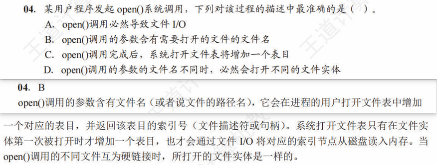
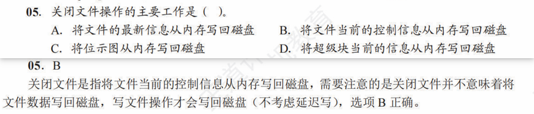

# 操作系统文件管理问题解析汇总

## `open()` 系统调用与文件I/O

**题面核心（基于如下图中的问题04选项A）：**

`open()` 调用是否必然导致文件I/O？

**疑惑**
某一个进程使用`open`系统调用打开一个文件，该文件的文件控制块（FCB）中的部分信息（如文件访问控制相关的内容等）不是也要复制到内存中进程的打开文件表吗？这是否意味着必然发生文件I/O？

**解释**
关于`open`操作会将文件控制块（FCB）或inode信息加载到内存（如进程打开文件表或系统打开文件表）的理解是正确的。这些信息包括文件权限、大小等元数据。

然而，`open()`调用**不必然**导致*新的物理磁盘I/O*，原因如下：

1. **元数据缓存**：操作系统会将频繁访问或最近访问的文件的元数据（FCB/inode）缓存在内存中（如buffer cache或inode cache）。
2. **缓存命中**：如果进程`open`一个其元数据已存在于内存缓存中的文件，操作系统可以直接从缓存中获取信息，无需执行新的磁盘读取操作。
3. **首次访问 vs. 后续访问**：
    * 如果元数据不在缓存中（如文件首次被访问或缓存已失效），`open()`确实会引发磁盘I/O来读取元数据。
    * 如果元数据已在缓存中，则不会发生新的磁盘I/O来获取这部分信息。

**结论**：虽然`open`操作需要访问元数据，并且这些元数据最终来源于磁盘，但由于缓存机制的存在，并非每次`open`调用都会立即触发一次新的物理磁盘I/O操作。因此，“`open()`调用必然导致文件I/O”的说法，如果指的是每次调用都发生新的物理磁盘读，是不准确的。

---

## `close()` 系统调用与写回文件控制信息

**题面核心（基于如下图中的问题05选项B）：**

关闭文件操作的主要工作是“将文件当前的控制信息从内存写回磁盘”。

**疑惑**
对于“写回文件的控制信息”，若不经过任何内容的修改，`close()`系统调用需要写回哪些控制信息呢？

**解释**
“写回文件控制信息”指的是在关闭文件时，将内存中已更新的、描述文件属性的**元数据（Metadata）**同步到磁盘上的文件控制块（FCB）或inode中。

1. **文件控制信息（元数据） vs. 文件数据**：
    * **文件控制信息**：描述文件属性，如文件大小、时间戳（创建时间、最后修改时间、**最后访问时间**）、访问权限、文件在磁盘上的位置索引等。
    * **文件数据**：文件的实际内容。

2. **为何要写回控制信息**：
    * 当文件被打开并进行操作（尤其是写入或修改属性）时，其在内存中缓存的元数据副本可能会被更新（例如，文件大小增加，最后修改时间改变）。
    * `close()`操作的一个核心任务就是确保这些在内存中被修改过的元数据被准确地写回到磁盘上对应的FCB或inode中。这保证了文件系统的一致性和数据的持久性，使得下次访问该文件时能获取到最新的属性信息。

3. **与写回文件数据的区别**：
    * 解析中强调，`close()`操作的核心是写回**控制信息**。
    * **文件数据**的写回通常由`write()`系统调用处理（可能通过写缓冲/延迟写机制），或者通过`fsync()`等同步调用强制刷新。虽然`close()`有时也可能触发数据缓冲区的刷新，但这不是其定义性的主要任务，其主要职责是确保元数据的更新和系统资源的释放。

**结论**：关闭文件时，将内存中已更改的**文件控制信息（元数据）**写回到磁盘，是确保文件系统状态与实际文件状态一致的关键步骤。这与文件实际内容的写回有所区别，后者更多与写操作本身和缓存刷新策略相关。若一个程序打开文件之后并没有进行修改操作，`close`系统调用会针对**最后访问时间**项进行写回操作。

## 数据文件和目录文件 FCB 的洞悉

* 数据文件的 FCB 管理**数据**的存储，目录文件的 FCB 管理**目录项**的存储
* 具体对应的**物理存储分配**方式又分为：
  1. 连续(filename, startBlock, blockNum)
  2. 链接(filename, startBlock, endBlock)-隐式链接
  3. 索引，混合索引用于数据文件的存储分配
* FCB 分解后，目录项大小锐减，目录瘦身完成，可以快速检索，**但是**，随之而来增加了根据索引节点编号读取相应的索引节点(inode)的磁盘I/O操作
* 为实现快速检索，还可以使用**相对路径**读取文件
* 综合以上内容，给定文件系统的构建机制和文件树，考察读取某一文件的**启动/存取磁盘次数**简直就是噩梦
