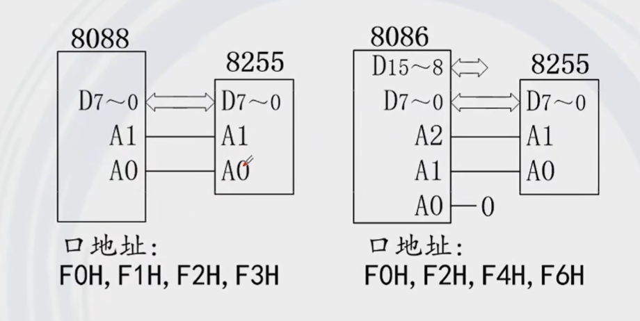

## 8255 控制字
- 方式控制字(确定 8255 工作方式, A,B,C 口的输入输出模式)
- C 口置位/复位控制字

## 8255 芯片工作方式
- 方式 0
  - 基本 I/O 方式
  - 适用于不需要应答联络的场合
  - 输出锁存, 输入无锁存
  - 端口 `PA`, `PB`, `PC7-4`, `PC3-0` 可以组成 16 种 I/O 方式 ($2^4$)
- 方式 1
  - 选通 I/O 方式
  - `PA`, `PB` 口可分别工作于方式 1, 均可作为输入/输出
  - `PA`, `PB` 之一工作于方式 1 时, `PC` 口就要有 3 位与之相配合, 此时, 另一端口及 `PC` 口的其余数据位可工作于方式 0
  - `PA`, `PB` 口均工作于方式 1, `PC` 口就要有 6 位与之相配合, 其余的 2 位仍可作 I/O

## 8255 端口地址映射
- 端口有 `PA`, `PB`, `PC` 和控制口, 其中分别对应 `A1`, `A0` 的值为 `00`, `01`, `10`, `11`
- 端口地址映射值是连续的, 但是实际的端口地址则不然, 必须分条件判断
- `8088` 控制下的 `8255` 的端口地址连续, `8086` 控制下的 `8255` 的端口地址间 1 连续
- `8088` 的数据总线为 8 位, `8086` 的数据总线为 16 位
 

## 实验要求
- 子实验1
  1. 根据 8255 基本输入输出实验接线图连接实验箱电路, 8255 的 B 口接逻辑电平开关 K0-K7, A 口接 LED 显示电路 L0-L7
  2. 编程实现通过开关 K0-K7 控制对应的 LED 灯亮


- 子实验2
  1. 根据 8255 方式 1 中断输入输出实验接线图连接试验箱电路
  2. 通过 MIR7 中断一次, 输入一次开关值到 LED (MIR7 直接连 KK1-)


## 实验源码
- 子实验1
```asm
;=========================================================
; 文件名: A82551.ASM
; 功能描述: A 口为输出，B 口为输入，将读入的数据输出显示
;           IOY0
;=========================================================

IOY0         EQU   0600H          ;片选 IOY0 对应的端口始地址
MY8255_A     EQU   IOY0+00H*2     ;8255 的 A 口地址
MY8255_B     EQU   IOY0+01H*2     ;8255 的 B 口地址
MY8255_C     EQU   IOY0+02H*2     ;8255 的 C 口地址
MY8255_MODE  EQU   IOY0+03H*2     ;8255 的控制寄存器地址

SSTACK	SEGMENT STACK
	DW 32 DUP(?)
SSTACK	ENDS
CODE	SEGMENT
		ASSUME CS:CODE
START:	
	MOV DX, MY8255_MODE
	MOV AL, 82H				;1000 0010
	OUT DX, AL
AA1:	
	MOV DX, MY8255_B
	IN  AL, DX
	CALL DELAY
	MOV DX, MY8255_A
	OUT DX, AL
	JMP AA1
DELAY:	
	PUSH CX
	MOV CX, 0F00H
AA2:
	PUSH AX
	POP  AX
	LOOP AA2
	POP  CX
	RET
CODE	ENDS
END  START
```

- 子实验2
```asm
;=========================================================
; 文件名: A82553.ASM
; 功能描述: 本实验使 8255 端口 A 工作在方式 0 并作为输出口，
;           端口 B 工作在方式 1 并作为输入口, 并处理外部中断
;=========================================================

IOY0         EQU   0600H          ;片选 IOY0 对应的端口始地址
MY8255_A     EQU   IOY0+00H*2     ;8255 的 A 口地址
MY8255_B     EQU   IOY0+01H*2     ;8255 的 B 口地址
MY8255_C     EQU   IOY0+02H*2     ;8255 的C口地址
MY8255_MODE  EQU   IOY0+03H*2     ;8255 的控制寄存器地址

STACK1 	SEGMENT STACK
        DW 256 DUP(?)
STACK1 	ENDS
CODE 	SEGMENT
        ASSUME CS:CODE
START: 	
	MOV DX,MY8255_MODE         ;初始化 8255 工作方式
	MOV AL,86H                 ; 1000 0110 
	OUT DX,AL				   ;A 口为工作方式 0 (输出)，B 口为工作方式 1 (输入)
	MOV DX,MY8255_MODE         ;C 口 PC2 置位
	MOV AL,05H                 ; 0000 1001
	OUT DX,AL

	;中断向量表的设置
	PUSH DS
	MOV AX, 0000H
	MOV DS, AX
	MOV AX, OFFSET MIR7			;取中断入口地址
	MOV SI, 003CH				;中断矢量地址
	MOV [SI], AX				;填 IRQ7 的偏移矢量
	MOV AX, CS					;段地址
	MOV SI, 003EH
	MOV [SI], AX				;填 IRQ7 的段地址矢量
	CLI
	POP DS

	;初始化主片 8259
	MOV AL, 11H
	OUT 20H, AL				;ICW1
	MOV AL, 08H
	OUT 21H, AL				;ICW2
	MOV AL, 04H
	OUT 21H, AL				;ICW3
	MOV AL, 01H
	OUT 21H, AL				;ICW4
	MOV AL, 6FH				;OCW1
	OUT 21H, AL
	STI       
AA1:	
	NOP
	JMP AA1
MIR7:  	
	PUSH AX
	MOV DX,MY8255_B            ;读 B 口
	IN  AL,DX
	CALL DELAY 				   ;调用延时程序
	MOV DX,MY8255_A            ;写 A 口
	OUT DX,AL
	MOV AL,20H
	OUT 20H,AL       
	POP AX  
	IRET  
DELAY:	
	PUSH CX
	MOV CX, 0F00H
AA0:	
	PUSH AX
	POP  AX
	LOOP AA0
	POP CX
	RET
CODE 	ENDS
END START
```

## 子实验1 要点分析

### 控制字设置
- START 为程序入口标签
- 设置 A 口为输出, B 口为输入, 且二者的工作方式均为方式 0
```asm
START:	
	MOV DX, MY8255_MODE
	MOV AL, 82H
	OUT DX, AL
```

### 主循环
- AA1 为主循环标签
- 层次逻辑: 读取 B 口数据, 经过一定延时, 将数据输出到 A 口
- `JMP AA1` 跳转回 AA1, 形成一个无限循环, 持续读取 B 口数据并输出到 A 口
```asm
AA1:	
	MOV DX, MY8255_B
	IN  AL, DX
	CALL DELAY
	MOV DX, MY8255_A
	OUT DX, AL
	JMP AA1
```

### 延时子程序
- DELAY 为延时子程序的标签
- `CX` 存储延时计数值 `00F0H`, 程序前后需要针对 `CX` 有压、弹栈的操作, 以保护现场
- AA2 为延时循环开始的标签
```asm
DELAY:	
	PUSH CX
	MOV CX, 0F00H
AA2:	
	PUSH AX
	POP  AX
	LOOP AA2
	POP  CX
	RET
```

## 子实验2 要点分析

### 程序入口
- 8255 中的 C 口置位/复位控制字与 8255 的控制字公用一个端口地址, 区分标志是控制字中的 D7
- 在方式 1 中, C 口的某些位用于握手信号:
  - PC4（STB#）：数据选通信号（Strobe）。当数据有效时，该线被拉低，通知接收设备数据已准备好。
  - PC2（INTR）：中断请求信号。当数据被成功接收时，B 口通过 PC2 发出中断请求。
  - PC1（IBF#）：输入缓冲区满信号（Input Buffer Full）。当数据被成功接收时，该线被拉高，通知发送设备输入缓冲区已满。
  - PC0（ACK#）：确认信号（Acknowledge）。接收设备通过该线通知发送设备数据已经被成功接收。
- 根据实验接线图的握手信号分析:
  - PC2 接受中断信号: 用于接受外部设备或传感器的中断信号(例如, KK1-), 通知 8255 有新数据需要处理
  - PC0 提交中断信号: 用于将中断信号提交给系统总线中的 MIR7, 从而触发系统的中断处理程序
- 为啥没有显示的 PC0 的置位操作:
  - 通过 8255 芯片的硬件逻辑和电路设计，控制信号的管理是自动进行的。PC0 作为确认信号，会在硬件逻辑中根据传输状态自动处理。
```asm
START:  
    MOV DX,MY8255_MODE         ; 初始化 8255 工作方式
    MOV AL,86H                 ; A 口为工作方式 0 (输出)，B 口为工作方式 1 (输入)
    OUT DX,AL
    MOV DX,MY8255_MODE         ; C 口 PC2 置位
    MOV AL,05H                 
    OUT DX,AL
```
