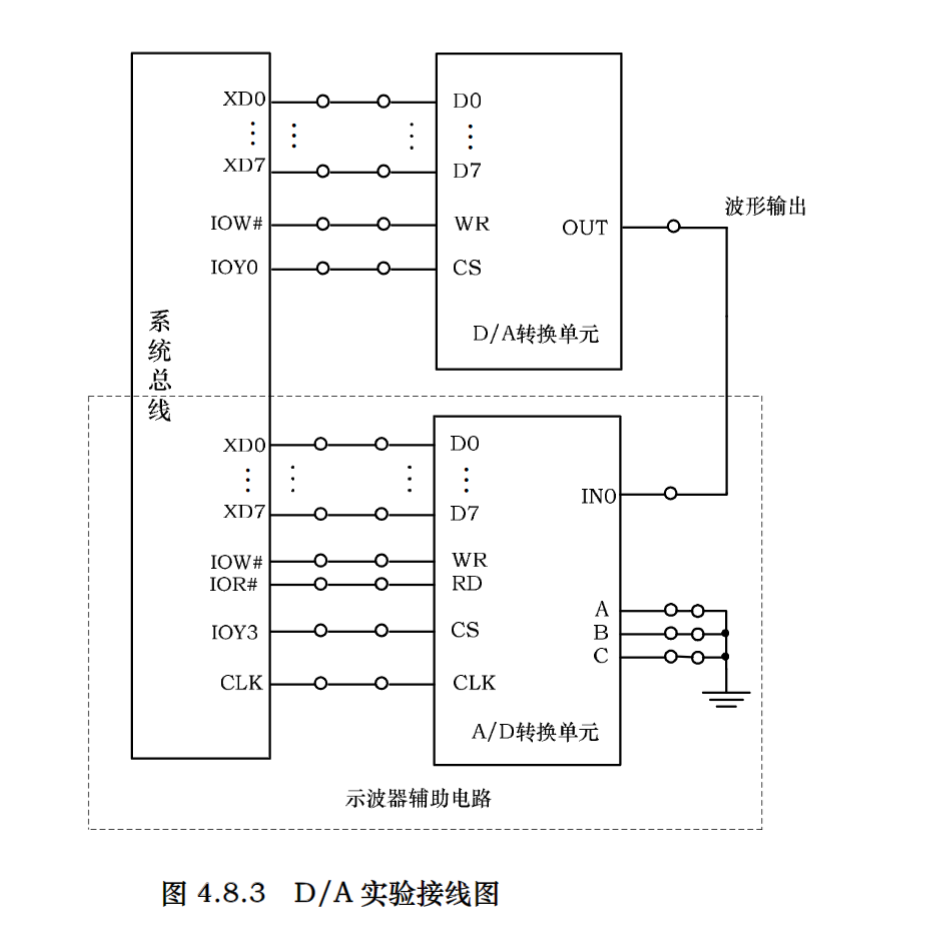

## DAC
- 数字信号经过数模转换器转换成模拟信号
- Digital-to-Analog Converter

## 实验内容
1. 编写程序实现数字信号到模拟信号的转换, 要求产生方波
2. 编写程序实现数字信号到模拟信号的转换, 要求产生锯齿波



## 实验源码

### 方波
```asm
;=========================================================
; 文件名: DA08322.ASM
; 功能描述: 利用 DA0832 产生方波，通过延时变化波形
;=========================================================

IOY0         EQU   0600H 
DA0832       EQU   IOY0+00H*2	

SSTACK	SEGMENT STACK
		DW 32 DUP(?)
SSTACK	ENDS
CODE	SEGMENT
		ASSUME CS:CODE

START:	MOV AX, 00H				; 产生方波
		MOV DX, DA0832
AA1:	MOV AL, 00H
		OUT DX, AL
		CALL DELAY
		MOV AL, 7FH
		OUT DX, AL
		CALL DELAY
		JMP AA1
DELAY:	PUSH CX
		MOV CX,0FF00H
AA2:	PUSH AX
		POP  AX
		LOOP AA2
		POP CX
		RET
CODE	ENDS
		END START
```

### 锯齿波
```asm
;=========================================================
; 文件名: DA08321.ASM
; 功能描述: 利用 DA0832 产生锯齿波，通过延时变化波形
;=========================================================

IOY0         EQU   0600H 
DA0832       EQU   IOY0+00H*2	

STACK	SEGMENT STACK
		DW 32 DUP(?)
STACK	ENDS
CODE	SEGMENT
ASSUME	CS:CODE, SS:STACK
START:	MOV AX, 00H				; 产生锯齿波
		MOV DX, DA0832
		MOV AL, 00H
AA1:	OUT DX, AL
		CALL DELAY
		INC AL
		JMP AA1	   
DELAY:	PUSH CX
		MOV CX, 03FFH
AA2:	PUSH AX
		POP  AX
		LOOP AA2
		POP CX
		RET  
CODE	ENDS
		END START
```

## 要点分析(方波)

### 段定义和常量定义
- `IOY0` 为 IO 端口的基地址, `DA0832` 为数模转换器的地址
- `SSTACK` 定义了一个 32 字单元的堆栈, 用于子程序调用和中断服务时保存现场
- `CODE` 定义代码段, 并假设 `CS` 寄存器指向这个段
```asm
IOY0         EQU   0600H 
DA0832       EQU   IOY0+00H*2	

SSTACK	SEGMENT STACK
		DW 32 DUP(?)
SSTACK	ENDS
CODE	SEGMENT
		ASSUME CS:CODE
```

### 方波产生循环
- `00H` 表示低电平, `7FH` 表示高电平
- 每设置电平后, 调用延时子程序, 产生对应电平的延时
```asm
AA1:	MOV AL, 00H
		OUT DX, AL
		CALL DELAY
		MOV AL, 7FH
		OUT DX, AL
		CALL DELAY
		JMP AA1
```

### 延时子程序
- 延时循环计数规模为 `0FF00H`
```asm
DELAY:	PUSH CX
		MOV CX,0FF00H
AA2:	PUSH AX
		POP  AX
		LOOP AA2
		POP CX
		RET
```


## 要点分析(锯齿波)

### 锯齿波产生循环
- 每次设定的电平值, 逐次递增加 1
- 此处的 `AL` 由于位数的限定, 达到最大值之后会自动回到最小值 
```asm
AA1:	OUT DX, AL
		CALL DELAY
		INC AL
		JMP AA1
```

### 延时子程序
- 延时循环计数规模为 `03FFH`
```asm
DELAY:	PUSH CX
		MOV CX, 03FFH
AA2:	PUSH AX
		POP  AX
		LOOP AA2
		POP CX
		RET
```