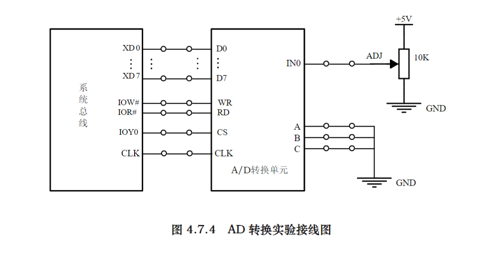

# ADC 实验记录

- 数模转换器将模拟信号转换成数字信号
- Analog-to-Digital Converter

## 实验内容

1. 编程采集 IN0 输入的电压



## 实验源码

```asm
;=========================================================
; 文件名: AD0809.ASM
; 功能说明: 进行 AD 采样，将结果显示。 片选为 IOY0
;=========================================================

IOY0         EQU   0600H 
AD0809       EQU   IOY0+00H*2     ;AD0809的端口地址

SSTACK SEGMENT STACK
 DW 64 DUP(?)
SSTACK ENDS
PUBLIC VALUE                ;设置全局变量以便变量监视
DATA SEGMENT
VALUE DB ?                  ;AD转换结果
DATA ENDS
CODE SEGMENT
 ASSUME CS:CODE, DS:DATA

START: MOV AX, DATA
 MOV DS, AX
 MOV DX, AD0809     ;启动 AD 采样
 OUT DX, AL
 CALL DALLY
 IN  AL, DX         ;读 AD 采样结果
 MOV VALUE, AL      ;将结果送变量
 JMP START          ;在此处设置断点, 观察变量窗口中的 VALUE 值

DALLY: PUSH CX     ;延时程序
 PUSH AX
 MOV CX, 100H
A5: MOV AX, 0800H
A6: DEC AX
 JNZ A6
 LOOP A5
 POP AX
 POP CX
 RET
CODE ENDS
END START
```

## 要点分析

### 段定义和常量定义

- `IOY0` 为 IO 端口的基地址, `AD0809` 为 AD0809 模数转换器的端口地址
- `SSTACK` 定义了一个 64 字单元的堆栈, 用于子程序调用和中断服务时保存现场
- `DATA` 段定义了数据段, 并声明了一个全局变量 value, 用于存储 AD 转换结果
- `CODE` 段定义了代码段, 并假设 `CS` 寄存器指向代码段, `DS` 寄存器指向数据段

```asm
IOY0         EQU   0600H 
AD0809       EQU   IOY0+00H*2      ;AD0809的端口地址

SSTACK SEGMENT STACK
 DW 64 DUP(?)
SSTACK ENDS
PUBLIC VALUE                ;设置全局变量以便变量监视
DATA SEGMENT
VALUE DB ?                  ;AD转换结果
DATA ENDS
CODE SEGMENT
ASSUME CS:CODE, DS:DATA
```

### 主程序部分

- 启动 AD 采样时通过 `OUT DX,AL` 向 AD0809 写入的并不是特定值, 而是作为一个启动信号(任意值)
- 调用 `DALLY` 延时子程序, 等待 AD 采样完成

```asm
START: MOV AX, DATA
 MOV DS, AX
 MOV DX, AD0809     ;启动 AD 采样
 OUT DX, AL
 CALL DALLY
 IN  AL, DX         ;读 AD 采样结果
 MOV VALUE, AL      ;将结果送变量
 JMP START          ;在此处设置断点, 观察变量窗口中的 VALUE 值
```

### 延时子程序

- 使用内、外双循环进行延时的操作

```asm
DALLY: PUSH CX         ;延时程序
 PUSH AX
 MOV CX, 100H
A5: MOV AX, 0800H
A6: EC AX
 JNZ A6
 LOOP A5
 POP AX
 POP CX
 RET
```
