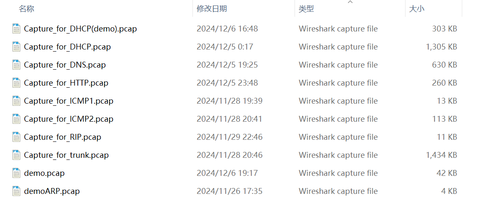

# 🌐 Computer Networks | 计算机网络

> **Institution**: Chang'an University
> **Status**: Archived (Undergraduate Coursework)

## 📖 简介 (Introduction)

《计算机网络》课程的实验内容涵盖了从物理层到应用层的核心协议理论，以及基于 **Wireshark**、**GNS3** 构建网络拓扑，进行抓包操作，并会分析数据包的关键字段

---

## 🧪 实验说明 (Lab Experiments)

本部分记录了课程相关的核心实验，旨在验证网络协议的工作原理及网络设备的配置方法。

### 🦈 协议分析 (Protocol Analysis)

> **工具**: Wireshark
> **内容**: 通过抓包分析 TCP/IP 协议栈各层头部结构与交互流程

---

## 📂 目录导航 (Directory Navigation)

* `Lab/`: 实验代码、网络拓扑、抓包文件
* `Lab\demo02\project-files\captures`：抓包信息
* `Lab\IOS`：构建拓扑图所需的路由镜像文件

### 实验网络拓扑图

### 抓包信息

