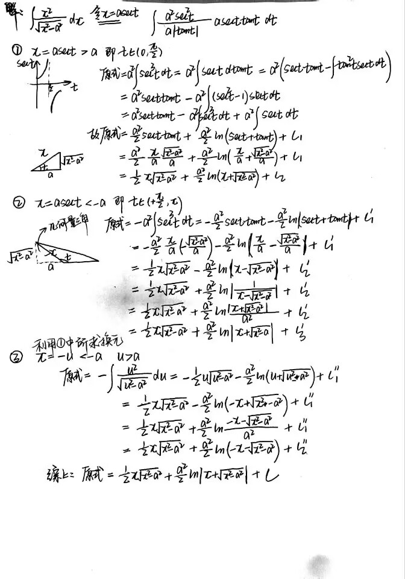
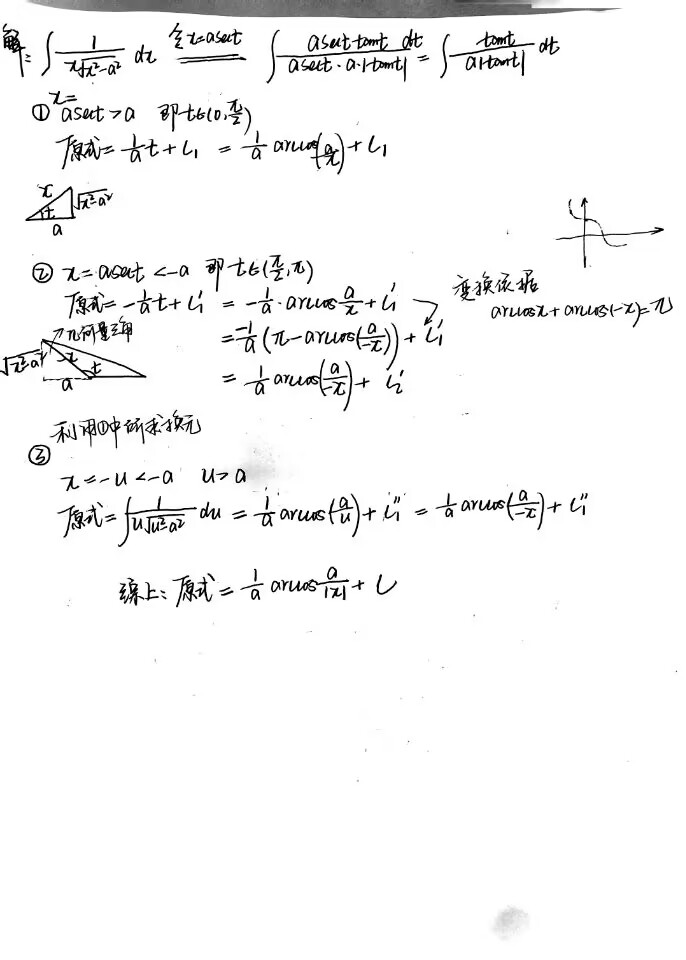
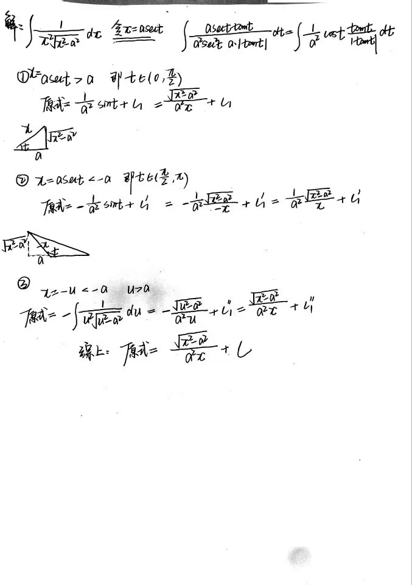
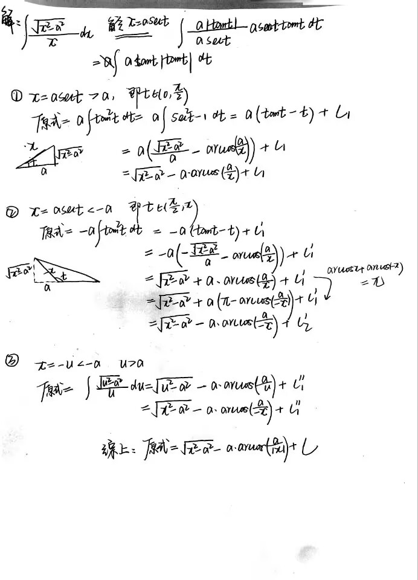
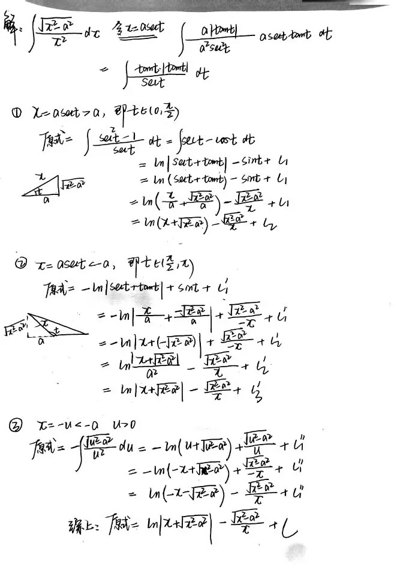

# $\sec t$ 换元积分分类讨论那些事儿

## 指导方针

依据换元式 $x = a\sec t$ 进行换元

1. 对于 $t \in (0, \frac{\pi}{2})$
依据 $\tan t > 0$ 去绝对值进行积分，再利用几何量三角回代变量 $x$
2. 对于 $t \in (\frac{\pi}{2}, \pi)$
依据 $\tan t < 0$ 去绝对值进行积分，再利用几何量三角回代变量 $x$
亦可利用先前针对 $t \in (0, \frac{\pi}{2})$ 的所求，进行 $x = -u$ 的换元处理，再回代变量 $x$
3. 将两种情况下的解的形式进行合并

## 小试牛刀

### Example 1

$$\int \frac{x^2}{\sqrt{x^2-a^2}} dx$$

### Example2

$$\int \frac{1}{x\sqrt{x^2-a^2}} dx$$

### Example3

$$\int \frac{1}{x^2\sqrt{x^2-a^2}} dx$$

### Example4

$$\int \frac{\sqrt{x^2-a^2}}{x} dx$$

### Example5

$$\int \frac{\sqrt{x^2-a^2}}{x^2} dx$$

