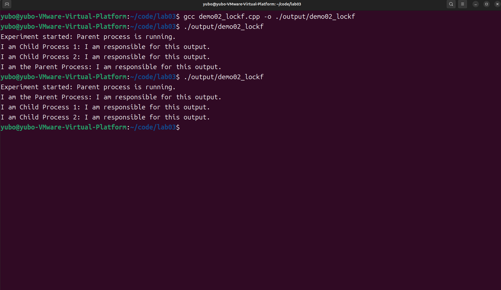
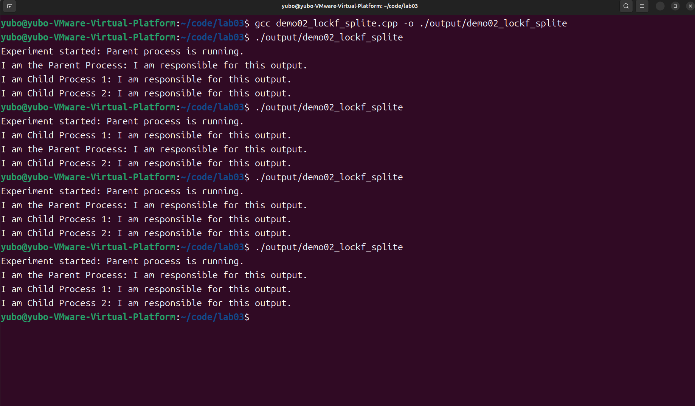

# test01

## 源代码
```cpp
#include <stdio.h>
#include <unistd.h>

int main() {
    pid_t pid1, pid2;

    // Parent process: output status message, then flush the buffer
    printf("Experiment started(none lockf): Parent process is running.\n");
    fflush(stdout);

    // First fork(): create Child Process 1
    pid1 = fork();
    if (pid1 == 0) {
        // Child Process 1 branch
        printf("I am Child Process 1: I am responsible for this output.\n");
        fflush(stdout);
        return 0;
    }

    // Second fork(): create Child Process 2
    pid2 = fork();
    if (pid2 == 0) {
        // Child Process 2 branch
        printf("I am Child Process 2: I am responsible for this output.\n");
        fflush(stdout);
        return 0;
    }

    // Parent process continues to output
    printf("I am the Parent Process: I am responsible for this output.\n");
    fflush(stdout);

    return 0;
}
```

# test02

## 源代码
```cpp
#include <stdio.h>
#include <unistd.h>
#include <fcntl.h>
#include <sys/types.h>

int main() {
    pid_t pid1, pid2;
    // 获取 stdout 的文件描述符，用于加锁
    int fd = fileno(stdout);

    // Parent process: output status message, then flush the buffer
    printf("Experiment started: Parent process is running.\n");
    fflush(stdout);

    // 第一次 fork(): 创建子进程1
    pid1 = fork();
    if (pid1 == 0) {
        // Child Process 1 branch:
        lockf(fd, F_LOCK, 0);   // 加锁确保输出互斥
        printf("I am Child Process 1: I am responsible for this output.\n");
        fflush(stdout);
        lockf(fd, F_ULOCK, 0);  // 解锁后退出
        return 0;
    }

    // 第二次 fork(): 创建子进程2
    pid2 = fork();
    if (pid2 == 0) {
        // Child Process 2 branch:
        lockf(fd, F_LOCK, 0);
        printf("I am Child Process 2: I am responsible for this output.\n");
        fflush(stdout);
        lockf(fd, F_ULOCK, 0);
        return 0;
    }

    // 父进程继续输出
    lockf(fd, F_LOCK, 0);
    printf("I am the Parent Process: I am responsible for this output.\n");
    fflush(stdout);
    lockf(fd, F_ULOCK, 0);

    return 0;
}
```

# 测试 test01 test02

## 测试结果展示





## test01 与 test02 的测试结果分析

1. 有锁、无锁版本的输出相似，很可能是以下因素的组合：
- 进程执行任务非常快速
- 操作系统调度的某种倾向性
- `fflush` 在一定程度上减少了缓冲带来的交错
- 短输出内容使得竞争窗口的概率极小

2. 为暴露无锁版本的潜在问题，修改方案如下：
- 增加每个进程的输出量（test03、test04 采用方式）
- 引入延时

---

# test03

## 源代码
```cpp
#include <stdio.h>
#include <unistd.h>
#include <sys/types.h>

int main() {
    pid_t pid1, pid2;
    
    // Parent process prints its start message in fragments.
    printf("Experiment ");
    fflush(stdout);
    printf("started: ");
    fflush(stdout);
    printf("Parent ");
    fflush(stdout);
    printf("process ");
    fflush(stdout);
    printf("is running.\n");
    fflush(stdout);

    // First fork: create Child Process 1
    pid1 = fork();
    if (pid1 == 0) {
        // Child Process 1 prints a message in several small parts.
        printf("I ");
        fflush(stdout);
        printf("am ");
        fflush(stdout);
        printf("Child ");
        fflush(stdout);
        printf("Process ");
        fflush(stdout);
        printf("1: ");
        fflush(stdout);
        printf("I ");
        fflush(stdout);
        printf("am ");
        fflush(stdout);
        printf("responsible ");
        fflush(stdout);
        printf("for ");
        fflush(stdout);
        printf("this ");
        fflush(stdout);
        printf("output.\n");
        fflush(stdout);
        return 0;
    }

    // Second fork: create Child Process 2
    pid2 = fork();
    if (pid2 == 0) {
        // Child Process 2 prints a message in several small parts.
        printf("I ");
        fflush(stdout);
        printf("am ");
        fflush(stdout);
        printf("Child ");
        fflush(stdout);
        printf("Process ");
        fflush(stdout);
        printf("2: ");
        fflush(stdout);
        printf("I ");
        fflush(stdout);
        printf("am ");
        fflush(stdout);
        printf("responsible ");
        fflush(stdout);
        printf("for ");
        fflush(stdout);
        printf("this ");
        fflush(stdout);
        printf("output.\n");
        fflush(stdout);
        return 0;
    }

    // Parent process prints another message in fragments.
    printf("I ");
    fflush(stdout);
    printf("am ");
    fflush(stdout);
    printf("the ");
    fflush(stdout);
    printf("Parent ");
    fflush(stdout);
    printf("Process: ");
    fflush(stdout);
    printf("I ");
    fflush(stdout);
    printf("am ");
    fflush(stdout);
    printf("responsible ");
    fflush(stdout);
    printf("for ");
    fflush(stdout);
    printf("this ");
    fflush(stdout);
    printf("output.\n");
    fflush(stdout);

    return 0;
}
```

# test04

## 源代码
```cpp
#include <stdio.h>
#include <unistd.h>
#include <fcntl.h>
#include <sys/types.h>

int main() {
    pid_t pid1, pid2;
    // 获取 stdout 的文件描述符，用于加锁
    int fd = fileno(stdout);
    
    // 父进程初始输出：整块输出前先加锁
    lockf(fd, F_LOCK, 0);
    printf("Experiment ");
    printf("started: ");
    printf("Parent ");
    printf("process ");
    printf("is running.\n");
    fflush(stdout);
    lockf(fd, F_ULOCK, 0);
    
    // 第一次 fork: 创建子进程 1
    pid1 = fork();
    if (pid1 == 0) {
        // 子进程 1 输出前加锁
        lockf(fd, F_LOCK, 0);
        printf("I ");
        printf("am ");
        printf("Child ");
        printf("Process ");
        printf("1: ");
        printf("I ");
        printf("am ");
        printf("responsible ");
        printf("for ");
        printf("this ");
        printf("output.\n");
        fflush(stdout);
        lockf(fd, F_ULOCK, 0);
        return 0;
    }
    
    // 第二次 fork: 创建子进程 2
    pid2 = fork();
    if (pid2 == 0) {
        // 子进程 2 输出前加锁
        lockf(fd, F_LOCK, 0);
        printf("I ");
        printf("am ");
        printf("Child ");
        printf("Process ");
        printf("2: ");
        printf("I ");
        printf("am ");
        printf("responsible ");
        printf("for ");
        printf("this ");
        printf("output.\n");
        fflush(stdout);
        lockf(fd, F_ULOCK, 0);
        return 0;
    }
    
    // 父进程继续输出：输出前加锁
    lockf(fd, F_LOCK, 0);
    printf("I ");
    printf("am ");
    printf("the ");
    printf("Parent ");
    printf("Process: ");
    printf("I ");
    printf("am ");
    printf("responsible ");
    printf("for ");
    printf("this ");
    printf("output.\n");
    fflush(stdout);
    lockf(fd, F_ULOCK, 0);
    
    return 0;
}
```

# 测试 test03 test04

## 测试结果展示




