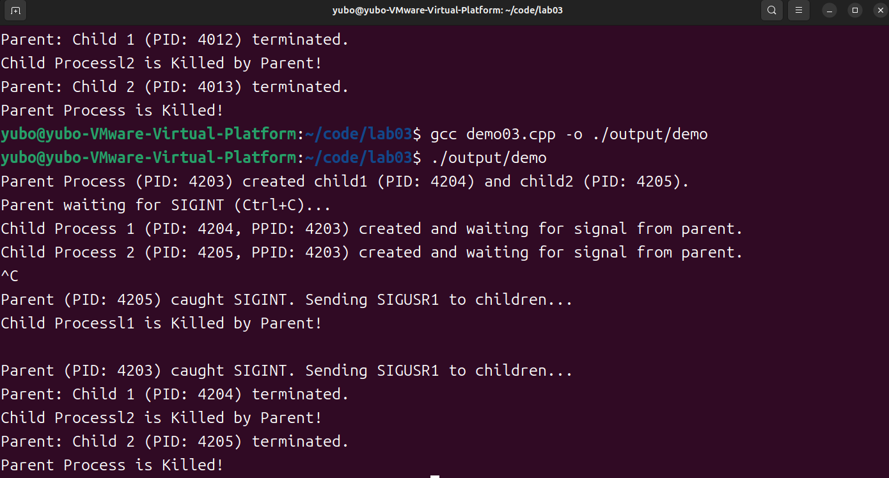
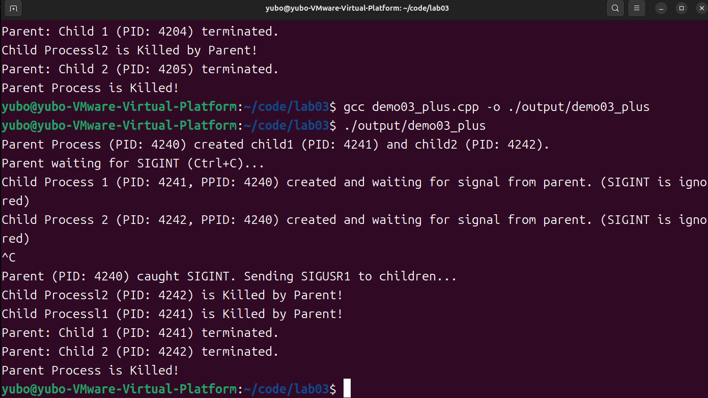

# 测试代码1
```cpp
#include <stdio.h>
#include <stdlib.h>
#include <unistd.h>
#include <signal.h>
#include <sys/wait.h>

// Global PIDs for child processes so signal handler can access them
pid_t pid1 = 0, pid2 = 0;

// Signal handler for child 1 (to handle SIGUSR1 from parent)
void child1_handler(int signum) {
    if (signum == SIGUSR1) {
        printf("Child Processl1 is Killed by Parent!\n");
        fflush(stdout); // Ensure message is printed before exit
        _exit(0); // Use _exit for async-signal safety
    }
}

// Signal handler for child 2 (to handle SIGUSR1 from parent)
void child2_handler(int signum) {
    if (signum == SIGUSR1) {
        printf("Child Processl2 is Killed by Parent!\n");
        fflush(stdout); // Ensure message is printed before exit
        _exit(0); // Use _exit for async-signal safety
    }
}

// Signal handler for parent (to handle SIGINT from keyboard)
void parent_sigint_handler(int signum) {
    if (signum == SIGINT) {
        printf("\nParent (PID: %d) caught SIGINT. Sending SIGUSR1 to children...\n", getpid());
        if (pid1 > 0) {
            kill(pid1, SIGUSR1);
        }
        if (pid2 > 0) {
            kill(pid2, SIGUSR1);
        }
        // The actual waiting for children and parent exit will happen in main
        // after this handler returns and pause() in main is interrupted.
    }
}

int main() {
    // Set up SIGINT handler for the parent process
    if (signal(SIGINT, parent_sigint_handler) == SIG_ERR) {
        perror("Parent: Can't catch SIGINT");
        exit(1);
    }

    // Create first child process
    pid1 = fork();

    if (pid1 < 0) {
        perror("Fork failed for child 1");
        exit(1);
    } else if (pid1 == 0) {
        // Child Process 1
        // Set up SIGUSR1 handler for child 1
        if (signal(SIGUSR1, child1_handler) == SIG_ERR) {
            perror("Child 1: Can't catch SIGUSR1");
            _exit(1);
        }
        printf("Child Process 1 (PID: %d, PPID: %d) created and waiting for signal from parent.\n", getpid(), getppid());
        fflush(stdout);
        while (1) {
            pause(); // Wait for a signal
        }
        // Should not reach here as handler calls _exit()
        _exit(0);
    } else {
        // Parent Process
        // Create second child process
        pid2 = fork();

        if (pid2 < 0) {
            perror("Fork failed for child 2");
            // Need to kill child1 if it was created successfully before exiting
            if (pid1 > 0) kill(pid1, SIGKILL);
            waitpid(pid1, NULL, 0); // Clean up child1
            exit(1);
        } else if (pid2 == 0) {
            // Child Process 2
            // Set up SIGUSR1 handler for child 2
            if (signal(SIGUSR1, child2_handler) == SIG_ERR) {
                perror("Child 2: Can't catch SIGUSR1");
                _exit(1);
            }
            printf("Child Process 2 (PID: %d, PPID: %d) created and waiting for signal from parent.\n", getpid(), getppid());
            fflush(stdout);
            while (1) {
                pause(); // Wait for a signal
            }
            // Should not reach here as handler calls _exit()
            _exit(0);
        } else {
            // Parent Process - main execution path
            printf("Parent Process (PID: %d) created child1 (PID: %d) and child2 (PID: %d).\n", getpid(), pid1, pid2);
            printf("Parent waiting for SIGINT (Ctrl+C)...\n");
            fflush(stdout);

            // Parent waits for SIGINT. The handler will be invoked.
            // After the handler runs, pause() will return (or be interrupted).
            pause();

            // At this point, SIGINT was caught, and parent_sigint_handler sent SIGUSR1 to children.
            // Now, wait for both children to terminate.
            int status1, status2;
            waitpid(pid1, &status1, 0);
            printf("Parent: Child 1 (PID: %d) terminated.\n", pid1);
            fflush(stdout);

            waitpid(pid2, &status2, 0);
            printf("Parent: Child 2 (PID: %d) terminated.\n", pid2);
            fflush(stdout);

            printf("Parent Process is Killed!\n"); // As per requirement
            fflush(stdout);
            exit(0);
        }
    }
    return 0; // Should not be reached by parent in normal flow
}
```

## 测试结果展示



## 问题描述

其中，PID `4204` 和 `4205` 实际上是子进程的PID，但它们打印的消息却以 "Parent (PID: ...)" 开头。理想情况下，只有真正的父进程（如PID `4203`）应该打印这条由其 `SIGINT` 处理器产生的消息。

## 原因分析

这种现象主要由以下两个 POSIX 系统特性共同导致：

### 1. 信号处理方式的继承 (Signal Disposition Inheritance)

* 当一个进程调用 `fork()` 创建一个子进程时，子进程会继承父进程许多属性。其中一个重要属性就是**信号的处理方式**（包括已注册的信号处理函数）。
* 在我们的代码中，父进程在调用 `fork()` **之前**为 `SIGINT` 信号设置了处理函数 `parent_sigint_handler`：
    ```c
    if (signal(SIGINT, parent_sigint_handler) == SIG_ERR) { /* ... */ }
    ```
* 因此，当子进程1和子进程2被创建后，它们**默认也会使用与父进程相同的 `parent_sigint_handler` 函数来处理它们接收到的 `SIGINT` 信号**。

### 2. `SIGINT` 信号的传递机制 (Ctrl+C)

* 当用户在终端按下 `Ctrl+C` 组合键时，终端驱动程序会向前台进程组 (foreground process group) 中的**所有进程**发送 `SIGINT` 信号。
* 在通常情况下，父进程以及由它创建的子进程（如果子进程没有被放入后台或新的进程组）都属于这个前台进程组。
* 所以，一次 `Ctrl+C` 操作会导致：
    * 父进程接收到 `SIGINT`。
    * 子进程1接收到 `SIGINT`。
    * 子进程2也接收到 `SIGINT`。

## 综合结果：多个进程执行同一处理函数

由于以上两点：
1.  所有三个进程（父、子1、子2）都接收到了 `SIGINT` 信号。
2.  所有三个进程都配置了使用**同一个函数** (`parent_sigint_handler`) 来响应该信号。

这就导致了：

* **父进程**执行 `parent_sigint_handler`：
    * 在其内部调用 `getpid()` 会得到父进程的PID。
    * 打印出 `Parent (PID: <父进程PID>) caught SIGINT...` （符合预期）。
    * 使用其拥有的、正确的子进程PID值（存储在全局变量 `pid1` 和 `pid2` 中）向子进程发送 `SIGUSR1`。

* **子进程1**（或子进程2）也执行 `parent_sigint_handler`：
    * 在其内部调用 `getpid()` 会得到该子进程自己的PID。
    * 打印出 `Parent (PID: <子进程PID>) caught SIGINT...`
    * 更糟糕的是，该子进程也会尝试执行 `kill(pid1, SIGUSR1)` 和 `kill(pid2, SIGUSR1)`。但此时，子进程拥有的全局变量 `pid1` 和 `pid2` 的副本可能对其自身上下文没有意义，或者指向错误的目标（例如，子进程1中其自身的 `pid1` 可能是0，`kill(0, ...)` 有特殊含义——发送给整个进程组，这可能导致递归信号或意外行为）。

## 结论与解决方案

这种行为通常不是期望的，因为它使得日志混乱，并且子进程可能会执行非预期的信号发送操作。实验的核心目的是让**父进程**响应用户的中断，并由父进程来协调子进程的终止。

**解决方案**是在子进程创建后，立即修改它们对 `SIGINT` 信号的处理方式，使其**忽略** `SIGINT` 信号。这可以通过在每个子进程的代码块开始处添加以下语句实现：

```c
if (signal(SIGINT, SIG_IGN) == SIG_ERR) {
    perror("Child X: Can't ignore SIGINT");
    _exit(1); // or handle error appropriately
}
```

---

# 改进之后的测试代码2
```c
#include <stdio.h>
#include <stdlib.h>
#include <unistd.h>
#include <signal.h>
#include <sys/wait.h>

// Global PIDs for child processes so signal handler can access them
pid_t pid1 = 0, pid2 = 0;

// Signal handler for child 1 (to handle SIGUSR1 from parent)
void child1_handler(int signum) {
    if (signum == SIGUSR1) {
        printf("Child Processl1 (PID: %d) is Killed by Parent!\n", getpid());
        fflush(stdout);
        _exit(0);
    }
}

// Signal handler for child 2 (to handle SIGUSR1 from parent)
void child2_handler(int signum) {
    if (signum == SIGUSR1) {
        printf("Child Processl2 (PID: %d) is Killed by Parent!\n", getpid());
        fflush(stdout);
        _exit(0);
    }
}

// Signal handler for parent (to handle SIGINT from keyboard)
void parent_sigint_handler(int signum) {
    if (signum == SIGINT) {
        printf("\nParent (PID: %d) caught SIGINT. Sending SIGUSR1 to children...\n", getpid());
        if (pid1 > 0) {
            kill(pid1, SIGUSR1);
        }
        if (pid2 > 0) {
            kill(pid2, SIGUSR1);
        }
    }
}

int main() {
    if (signal(SIGINT, parent_sigint_handler) == SIG_ERR) {
        perror("Parent: Can't catch SIGINT");
        exit(1);
    }

    pid1 = fork();

    if (pid1 < 0) {
        perror("Fork failed for child 1");
        exit(1);
    } else if (pid1 == 0) {
        // Child Process 1
        // ***** ADD PART *****
        if (signal(SIGINT, SIG_IGN) == SIG_ERR) { // Child 1 ignores SIGINT
            perror("Child 1: Can't ignore SIGINT");
            _exit(1);
        }
        // ********************
        if (signal(SIGUSR1, child1_handler) == SIG_ERR) {
            perror("Child 1: Can't catch SIGUSR1");
            _exit(1);
        }
        printf("Child Process 1 (PID: %d, PPID: %d) created and waiting for signal from parent. (SIGINT is ignored)\n", getpid(), getppid());
        fflush(stdout);
        while (1) {
            pause();
        }
        _exit(0); // Should not reach here
    } else {
        // Parent Process
        pid2 = fork();

        if (pid2 < 0) {
            perror("Fork failed for child 2");
            if (pid1 > 0) kill(pid1, SIGKILL);
            waitpid(pid1, NULL, 0);
            exit(1);
        } else if (pid2 == 0) {
            // Child Process 2
            // ***** ADD PART *****
            if (signal(SIGINT, SIG_IGN) == SIG_ERR) { // Child 2 ignores SIGINT
                perror("Child 2: Can't ignore SIGINT");
                _exit(1);
            }
            // ********************
            if (signal(SIGUSR1, child2_handler) == SIG_ERR) {
                perror("Child 2: Can't catch SIGUSR1");
                _exit(1);
            }
            printf("Child Process 2 (PID: %d, PPID: %d) created and waiting for signal from parent. (SIGINT is ignored)\n", getpid(), getppid());
            fflush(stdout);
            while (1) {
                pause();
            }
            _exit(0); // Should not reach here
        } else {
            // Parent Process - main execution path
            printf("Parent Process (PID: %d) created child1 (PID: %d) and child2 (PID: %d).\n", getpid(), pid1, pid2);
            printf("Parent waiting for SIGINT (Ctrl+C)...\n");
            fflush(stdout);
            pause();

            int status1, status2;
            waitpid(pid1, &status1, 0);
            printf("Parent: Child 1 (PID: %d) terminated.\n", pid1);
            fflush(stdout);

            waitpid(pid2, &status2, 0);
            printf("Parent: Child 2 (PID: %d) terminated.\n", pid2);
            fflush(stdout);

            printf("Parent Process is Killed!\n");
            fflush(stdout);
            exit(0);
        }
    }
    return 0;
}
```

## 测试结果展示

