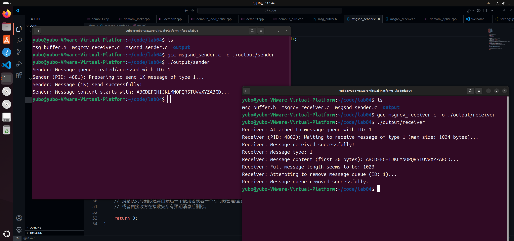
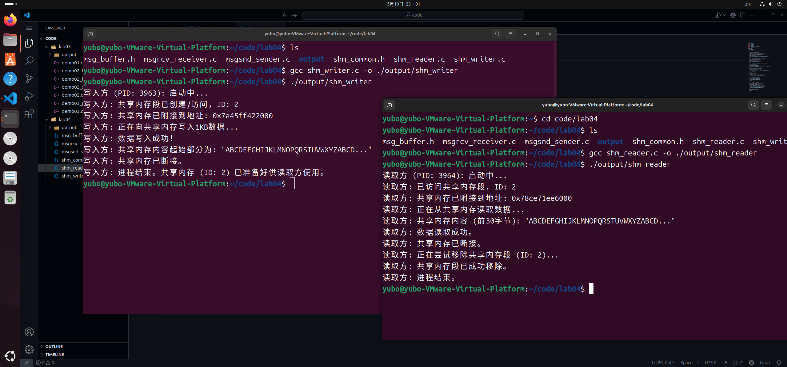
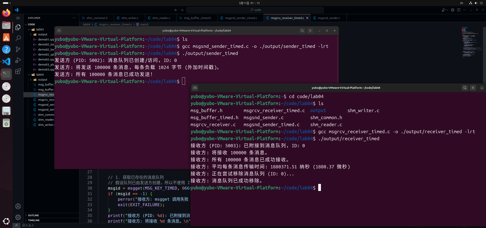
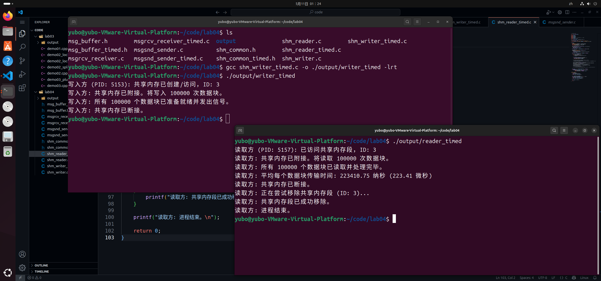

# 进程的通信

## test01——(**消息传递**)

### test01 涉及的系统调用

- `msgget()`
- `msgsnd()`
- `msgrcv()`
- `msgctl()`

### 消息结构定义

#### msg_buffer 源代码

```c
// msg_buffer.h
#ifndef MSG_BUFFER_H
#define MSG_BUFFER_H

#include <sys/types.h>

#define MSG_KEY 1234 // 消息队列的键值，发送方和接收方必须一致
#define MSG_SIZE 1024 // 消息数据部分长度为 1K

// 消息结构体
// msgsnd 和 msgrcv 要求消息的第一个成员是 long 类型的消息类型
struct msg_buffer {
    long msg_type;          // 消息类型，必须大于 0
    char msg_text[MSG_SIZE]; // 消息内容
};

#endif //MSG_BUFFER_H
```

#### msg_buffer 源代码注释

- `MSG_KEY`: 一个任意选择但发送方和接收方必须一致的整数，用于唯一标识一个**消息队列**。可将其视作是消息队列的“名字”或“地址”。
- `MSG_SIZE`: 定义了消息中数据部分的大小，这里是 1KB。
- `struct msg_buffer`: 定义了消息的结构（消息头、消息体）
  - `msg_type`：System V 消息队列要求消息的第一个成员必须是 long 类型的消息类型 (msg_type)。严格来说，是“消息体”的实际内容，而是消息的元数据（metadata），用于**消息**的分类、过滤和接收时的选择。可将其视为消息的一个“标签”或“信封上的地址类型”。
  - `msg_text`：存储实际的数据，此成员代表了实际想要在进程间传递的数据内容。即通常意义上的“消息体”或“消息负载 (payload)”。

### msgsnd_sender 发送方实现

#### msgsnd_sender 源代码

```c
// msgsnd_sender.c
#include <stdio.h>
#include <stdlib.h>
#include <string.h>
#include <sys/ipc.h>    // 包含 System V IPC 需要的定义
#include <sys/msg.h>    // 包含消息队列相关的定义
#include <unistd.h>     // For getpid()
#include "msg_buffer.h" // 包含自定义的消息结构和 KEY

int main() {
    int msgid;  // 用于存储消息队列的标识符
    struct msg_buffer message;  // 声明一个消息缓冲区变量

    // 1. 创建或获取消息队列
    // IPC_CREAT: 如果键值 MSG_KEY 的消息队列不存在，则创建它，否则，则直接打开
    // 0666: 设置消息队列的访问权限为 rw-rw-rw- （用户、组、其他用户都具有读写权限）
    msgid = msgget(MSG_KEY, IPC_CREAT | 0666);  // 权限值 0(xxx) 表示八进制 octal
    if (msgid == -1) {
        perror("msgget failed");
        exit(EXIT_FAILURE); // 异常退出
    }
    printf("Sender: Message queue created/accessed with ID: %d\n", msgid);

    // 2. 准备要发送的消息
    message.msg_type = 1; // 设置消息类型为 1，接收方可以根据这个类型来选择性接收消息
                          // 类型值必须大于 0。
    // 填充 1K 的数据到消息文本中
    for (int i = 0; i < MSG_SIZE -1; ++i) {
        message.msg_text[i] = 'A' + (i % 26);   // A-Z 循环填充
    }
    message.msg_text[MSG_SIZE - 1] = '\0'; // 确保字符串以 null 结束

    printf("Sender (PID: %d): Preparing to send 1K message of type %ld...\n", getpid(), message.msg_type);
    // snprintf(message.msg_text, MSG_SIZE, "Hello from sender (PID: %d)! This is a 1K message.", getpid());

    // 3. 发送消息
    // msgsnd(msgid, &message, sizeof(message.msg_text), flags);
    // 第三个参数 sizeof(message.msg_text) 是消息正文的长度，不包括 msg_type 成员
    // 第四个参数 0 表示如果消息队列已满，则 msgsnd 调用会阻塞，直到队列有空间
    if (msgsnd(msgid, &message, sizeof(message.msg_text), 0) == -1) {
        perror("msgsnd failed");
        // 如果发送失败，可以考虑删除消息队列，通常由管理程序或接收方完成清理
        // msgctl(msgid, IPC_RMID, NULL);
        exit(EXIT_FAILURE);
    }

    printf("Sender: Message (1K) send successfully!\n");
    printf("Sender: Message content starts with: %.30s...\n", message.msg_text);

    // HINT 发送方通常不删除消息队列，除非它是队列的唯一管理者
    // 消息队列的删除通常由最后一个使用者或者一个专门的管理程序来完成
    // 或者由接收方在接收完所有预期消息后删除。

    return 0;   // 正常退出
}
```

### msgrcv_receiver 接收方实现

#### msgrcv_receiver 源代码

```c
// msgrcv_receiver.c
#include <stdio.h>
#include <stdlib.h>
#include <string.h>
#include <sys/ipc.h>
#include <sys/msg.h>
#include <unistd.h> // For getpid()
#include "msg_buffer.h"

int main() {
    int msgid;  // 用于存储消息队列的标识符
    struct msg_buffer received_message; // 声明一个消息缓冲区变量用于接收

    // 1. 获取已存在的消息队列
    // HINT：接收方通常假设队列已由发送方创建，故不再使用 IPC_CREAT
    // 此处只传入 MSG_KEY 和权限 0666（如果队列存在，这里的权限通常不起创建作用，而是用于访问检查）
    // 如果接收方也可能先启动，可以也使用 IPC_CREAT
    msgid = msgget(MSG_KEY, 0666);
    if (msgid == -1) {
        // 如果队列不存在，msgget会失败
        perror("msgget failed (receiver - queue may not exist yet)");
        exit(EXIT_FAILURE);
    }
    printf("Receiver: Attached to message queue with ID: %d\n", msgid);

    // 2. 接收消息
    // msgrcv(msgid, &buffer, size, type, flags)
    // size: 所要接收的消息正文的最大长度
    // type:
    //   0: 接收队列中的第一条消息
    //  >0: 接收类型为 type 的第一条消息
    //  <0: 接收类型 <= type 绝对值 的消息中类型最小的第一条
    // flags:
    //   0: 阻塞等待直到接收到消息
    //   IPC_NOWAIT: 非阻塞，如果没有符合条件的消息则立即返回错误(ENOMSG)
    //   MSG_NOERROR: 如果实际消息长度超过请求的 size，则截断消息而不是返回错误

    printf("Receiver (PID: %d): Waiting to receive message of type 1 (max size: %d bytes)...\n", getpid(), MSG_SIZE);
    if (msgrcv(msgid, &received_message, sizeof(received_message.msg_text), 1, 0) == -1) {
        perror("msgrcv failed");
        exit(EXIT_FAILURE);
    }

    printf("Receiver: Message received successfully!\n");
    printf("Receiver: Message type: %ld\n", received_message.msg_type);
    printf("Receiver: Message content (first 30 bytes): %.30s...\n", received_message.msg_text);
    printf("Receiver: Full message length seems to be: %zu\n", strlen(received_message.msg_text));

    // 3. 删除消息队列 (通常在接收方完成所有操作后)
    // IPC_RMID: 删除消息队列
    // 只有当所有进程都与队列断开连接后，队列才会被真正销毁。
    // 如果希望接收完一条消息就删除队列，可以在这里做。
    // 但如果希望队列持续存在供多个消息交换，则不应立即删除。
    // 如下的示例中，接收方接收一条消息后就删除队列。
    printf("Receiver: Attempting to remove message queue (ID: %d)...\n", msgid);
    if (msgctl(msgid, IPC_RMID, NULL) == -1) {
        perror("msgctl(IPC_RMID) failed");
        // exit(EXIT_FAILURE); // 可以选择是否因删除失败而退出
    } else {
        printf("Receiver: Message queue removed successfully.\n");
    }

    return 0;
}
```

### `msgctl()` 系统调用的作用分析

- receiver 程序中，通过 `IPC_RMID` 命令来请求删除消息队列。
- **资源释放**：System V IPC (**System V inter-Process Communication**)对象（包括消息队列、信号量、共享内存）是内核持续维护的资源。它们不会因为创建它们的进程退出而自动消失。如果不显式删除，它们会一直存在于系统中，直到系统重启或被手动工具（如 `ipcrm` 命令）删除。这可能导致系统资源的泄露。
- **清理责任**：通常，设计良好的应用程序会确保在 IPC 对象不再需要时将其删除。上述的测试案例中，接收方在完成其任务（接收消息）后承担了清理消息队列的责任。

### test01 测试结果展示



---

## test02——(**共享存储**)

### test02 涉及的系统调用

- `shmget()`
- `shmat()`
- `shmdt()`
- `shmctl()`

### shm_common 共享内存定义

#### shm_common 源代码

```c
// shm_common.h
#ifndef SHM_COMMON_H
#define SHM_COMMON_H

#include <sys/types.h> // For key_t and other basic types

// 定义共享内存的键值，写入方和读取方必须使用相同的值
#define SHM_KEY 6789

// 定义共享内存的大小为 1KB (1024 字节)
#define SHM_SIZE 1024

// 对于这个实验，我们直接将共享内存视为字符数组，故不需要在这里定义复杂的共享数据结构
// 如果要传输结构化数据，可以在这里定义一个 struct

#endif //SHM_COMMON_H
```

### shm_writer 写入方实现

#### shm_writer 源代码

```c
// shm_writer.c
#include <stdio.h>    // 标准输入输出函数，如 printf，perror
#include <stdlib.h>   // 标准库函数，如 exit
#include <string.h>
#include <sys/ipc.h>  // System V IPC 通用头文件，包含 key_t, ftok 等
#include <sys/shm.h>  // System V 共享内存特定头文件 (shmget, shmat, shmdt, shmctl)
#include <unistd.h>   // 为了 getpid()
#include "shm_common.h" // 包含 SHM_KEY 和 SHM_SIZE

int main() {
    int shmid;     // 用于存储共享内存段的标识符（Shared Memory ID）
    char *shm_ptr; // 指向共享内存附接到本进程地址空间后的起始位置的指针

    printf("写入方 (PID: %d): 启动中...\n", getpid());

    // 1. 创建或访问共享内存段
    // shmget(key, size, shmflg)
    // 第一个参数 SHM_KEY:  shm_common.h 中定义的共享内存的键值
    // 第二个参数 SHM_SIZE: 期望的共享内存大小
    // 第三个参数 shmflg (标志位):
    //    IPC_CREAT: 如果键值为 SHM_KEY 的共享内存段不存在，则创建它。如果已存在，则此标志不起作用（除非与IPC_EXCL联用）
    //    | (按位或操作符): 用于组合多个标志
    //    0666: 八进制数，表示共享内存的访问权限 (用户、组、其他用户都具有读和写权限)
    //          前面的 '0' 表示这是一个八进制数。
    shmid = shmget(SHM_KEY, SHM_SIZE, IPC_CREAT | 0666);
    if (shmid == -1) {
        perror("写入方: shmget 调用失败");
        exit(EXIT_FAILURE);
    }
    printf("写入方: 共享内存段已创建/访问，ID: %d\n", shmid);

    // 2. 将共享内存段附接到进程的地址空间
    // shmat(shmid, shmaddr, shmflg)
    // 第一个参数 shmid: 从 shmget 获取到的共享内存 ID
    // 第二个参数 shmaddr (期望的附接地址):
    //    NULL: 表示让操作系统内核自动选择一个合适的、当前进程未使用的虚拟地址来附接共享内存。这是推荐的做法，以保证可移植性和避免地址冲突。
    // 第三个参数 shmflg (标志位):
    //    0: 表示默认行为。通常意味着以可读写方式附接（如果共享内存段本身的权限允许）。
    shm_ptr = (char *)shmat(shmid, NULL, 0);
    if (shm_ptr == (void *)-1) {        // shmat 的错误检查
        perror("写入方: shmat 调用失败");
        // 如果附接失败，一个好的做法是考虑移除刚刚由 shmget 创建（如果它是创建者）的共享内存段，
        // 因为此进程无法使用它。
        if (shmctl(shmid, IPC_RMID, NULL) == -1) {
            perror("写入方: shmat 失败后调用 shmctl(IPC_RMID) 失败");
        } else {
            printf("写入方: shmat 失败后已移除共享内存段。\n");
        }
        exit(EXIT_FAILURE);
    }
    printf("写入方: 共享内存已附接到地址: %p\n", (void *)shm_ptr);

    // 3. 向共享内存写入数据 (1KB)
    // 附接成功后，shm_ptr 就指向了一块可以像普通内存一样读写的区域
    printf("写入方: 正在向共享内存写入1KB数据...\n");
    for (int i = 0; i < SHM_SIZE - 1; ++i) {
        shm_ptr[i] = 'A' + (i % 26); // 用A-Z循环填充
    }
    shm_ptr[SHM_SIZE - 1] = '\0'; // C 风格字符串结束处理

    printf("写入方: 数据写入成功！\n");
    printf("写入方: 共享内存内容起始部分为: \"%.30s...\"\n", shm_ptr);

    // 4. 从进程的地址空间断接共享内存段
    // shmdt(shmaddr)
    // 参数 shmaddr：shmat 函数返回的，指向共享内存的指针
    // 断接后，当前进程就不能再通过 shm_ptr 访问这块内存了
    // HINT：段接并不删除共享内存段本身，其仍然存在于内核中，其他已附接的进程仍可访问
    if (shmdt(shm_ptr) == -1) {
        perror("写入方: shmdt 调用失败");
        // 断接失败是一个比较严重的错误，但程序逻辑上可能仍需尝试退出
    } else {
        printf("写入方: 共享内存已断接。\n");
    }

    // 关于删除共享内存段，写入方不立即删除共享内存段
    // 删除共享内存段的责任留给了读取方，在它读取数据之后完成
    // 这是一种常见的设计模式，确保数据在被读取前不会意外丢失
    // 在实际场景中，删除逻辑需要明确定义。
    printf("写入方: 进程结束。共享内存 (ID: %d) 已准备好供读取方使用。\n", shmid);

    return 0;
}
```

### shm_reader 读取方实现

#### shm_reader 源代码

```c
// shm_reader.c
#include <stdio.h>
#include <stdlib.h>
#include <string.h>
#include <sys/ipc.h>
#include <sys/shm.h>
#include <unistd.h>   // 为了 getpid()
#include "shm_common.h"

int main() {
    int shmid;      // 共享内存段的 ID
    char *shm_ptr;  // 指向共享内存段的指针

    printf("读取方 (PID: %d): 启动中...\n", getpid());

    // 1. 获取已存在的共享内存段(读取方假定段已由写入方创建)
    // 调用 shmget 函数
    // 此处指定 SHM_SIZE 以确保我们访问的是预期大小的段
    // (尽管如果段已存在，shmget 在 size=0 时也可能工作，但指定大小更利于验证)。
    // 0666 是访问所需的权限
    shmid = shmget(SHM_KEY, SHM_SIZE, 0666);
    if (shmid == -1) {
        perror("读取方: shmget 调用失败 (段可能不存在或权限问题)");
        exit(EXIT_FAILURE);
    }
    printf("读取方: 已访问共享内存段，ID: %d\n", shmid);

    // 2. 将共享内存段附接到进程的地址空间
    shm_ptr = (char *)shmat(shmid, NULL, 0);
    if (shm_ptr == (void *)-1) {
        perror("读取方: shmat 调用失败");
        exit(EXIT_FAILURE);
    }
    printf("读取方: 共享内存已附接到地址: %p\n", (void *)shm_ptr);

    // 3. 从共享内存读取数据
    printf("读取方: 正在从共享内存读取数据...\n");
    // 我们假定写入方已写入 1KB 数据。
    printf("读取方: 共享内存内容 (前30字节): \"%.30s...\"\n", shm_ptr);

    printf("读取方: 数据读取成功。\n");

    // 4. 从进程的地址空间断接共享内存段
    if (shmdt(shm_ptr) == -1) {
        perror("读取方: shmdt 调用失败");
    } else {
        printf("读取方: 共享内存已断接。\n");
    }

    // 5. 删除共享内存段
    // 调用 shmctl 函数，使用　IPC_RMID 命令，此操作会标记该共享内存段为“待删除”
    // 第三个参数 buf 对于 IPC_RMID 通常是 NULL
    printf("读取方: 正在尝试移除共享内存段 (ID: %d)...\n", shmid);
    if (shmctl(shmid, IPC_RMID, NULL) == -1) {
        perror("读取方: shmctl(IPC_RMID) 调用失败");
        // 即使删除失败，也终止进程。
        // 可能是其他进程已将其删除，或者存在权限问题。
    } else {
        printf("读取方: 共享内存段已成功移除。\n");
    }

    printf("读取方: 进程结束。\n");

    return 0;
}
```

### test02 测试结果展示



---

## test03——(比较上述两种进程间通信机制下的数据传输时间)

测试方法：通过设定传输规定迭代次数条的消息，每条消息依然保持 1K 大小，`clock_gettime(CLOCK_MONOTONIC, ...)` 函数来获取高精度时间，其不受系统时钟调整的影响

### **消息传递**的数据传输实现

#### msg_buffer_timed 消息结构定义

##### msg_buffer_timed 源代码

```c
// msg_buffer_timed.h
#ifndef MSG_BUFFER_TIMED_H
#define MSG_BUFFER_TIMED_H

#include <sys/types.h>
#include <time.h> // 为了 struct timespec

#define MSG_KEY_TIMED 1235 // 为计时实验使用新的消息队列键值
#define ACTUAL_DATA_SIZE 1024 // 实际用户数据的大小 (1KB)

// 包含发送时间戳的消息结构体
struct msg_buffer_timed {
    long msg_type;                    // 消息类型，必须大于 0
    struct timespec send_start_time;  // 发送方记录的起始时间戳
    char user_data[ACTUAL_DATA_SIZE]; // 用户数据
};

// msgsnd/msgrcv 函数需要的消息正文大小 (时间戳 + 用户数据)
#define MSG_PAYLOAD_SIZE_TIMED (sizeof(struct timespec) + ACTUAL_DATA_SIZE)

#endif //MSG_BUFFER_TIMED_H
```

#### msgsnd_sender_timed 发送方实现

##### msgsnd_sender_timed 源代码

```c
// msgsnd_sender_timed.c

// 启用 POSIX.1-2008 标准，以确保 clock_gettime 和 CLOCK_MONOTONIC 可用
#define _POSIX_C_SOURCE 200809L

#include <stdio.h>
#include <stdlib.h>
#include <string.h>
#include <sys/ipc.h>
#include <sys/msg.h>
#include <unistd.h> // 为了 usleep (if use) 和 getpid
#include <time.h>   // 为了 clock_gettime
#include "msg_buffer_timed.h"

#define ITERATIONS 100000 // 定义发送/接收的迭代次数

int main() {
    int msgid;
    struct msg_buffer_timed message; // 使用带时间戳的消息结构

    // 1. 创建或获取消息队列
    msgid = msgget(MSG_KEY_TIMED, IPC_CREAT | 0666);
    if (msgid == -1) {
        perror("发送方: msgget 调用失败");
        exit(EXIT_FAILURE);
    }
    printf("发送方 (PID: %d): 消息队列已创建/访问，ID: %d\n", getpid(), msgid);
    printf("发送方: 将发送 %d 条消息，每条负载 %d 字节 (外加时间戳)。\n", ITERATIONS, ACTUAL_DATA_SIZE);

    message.msg_type = 1; // 设置消息类型
    // 预先填充用户数据 (在循环外填充一次即可，因为内容相同)
    for (int i = 0; i < ACTUAL_DATA_SIZE - 1; ++i) {
        message.user_data[i] = 'M'; // 用字符'M'填充
    }
    message.user_data[ACTUAL_DATA_SIZE - 1] = '\0'; // 确保字符串结束

    // 循环发送 ITERATIONS 次消息
    for (int k = 0; k < ITERATIONS; ++k) {
        // 2. 在发送消息前，记录当前时间戳并存入消息结构体
        if (clock_gettime(CLOCK_MONOTONIC, &message.send_start_time) == -1) {
            perror("发送方: clock_gettime 调用失败");
            exit(EXIT_FAILURE); // 严重错误，直接退出
        }

        // 3. 发送包含时间戳和数据的消息
        if (msgsnd(msgid, &message, MSG_PAYLOAD_SIZE_TIMED, 0) == -1) {
            perror("发送方: msgsnd 调用失败");
            // 如果发送失败，可以考虑清理消息队列并退出
            msgctl(msgid, IPC_RMID, NULL);
            exit(EXIT_FAILURE);
        }
        // 可选：微小延时，避免发送方速度过快，给接收方留出处理时间，
        // 但这会影响纯粹的传输时间测量。对于IPC性能基准测试，通常不加。
        // if (k % 1000 == 0) usleep(1);
    }

    printf("发送方: 所有 %d 条消息已成功发送！\n", ITERATIONS);
    // 发送方在此不删除消息队列，等待接收方读取完毕后删除。

    return 0;
}
```

#### msgrcv_receiver_timed 接收方实现

##### msgrcv_receiver_timed 源代码

```c
// msgrcv_receiver_timed.c

#define _POSIX_C_SOURCE 200809L

#include <stdio.h>
#include <stdlib.h>
#include <string.h>
#include <sys/ipc.h>
#include <sys/msg.h>
#include <unistd.h>
#include <time.h>
#include "msg_buffer_timed.h"

#define ITERATIONS 100000 // 接收迭代次数，应与发送方一致

// 辅助函数：计算两个 timespec 结构体之间的时间差，返回纳秒
long long timespec_diff_ns(struct timespec start, struct timespec end) {
    return (end.tv_sec - start.tv_sec) * 1000000000LL + (end.tv_nsec - start.tv_nsec);
}

int main() {
    int msgid;
    struct msg_buffer_timed received_message; // 用于接收消息的缓冲区
    struct timespec recv_end_time;           // 记录接收完成的时间戳
    long long total_duration_ns = 0;         // 累积总传输时间（纳秒）
    long long single_trip_duration_ns;       // 单次传输时间（纳秒）

    // 1. 获取已存在的消息队列
    // 假设队列已由发送方创建，所以不使用 IPC_CREAT
    msgid = msgget(MSG_KEY_TIMED, 0666);
    if (msgid == -1) {
        perror("接收方: msgget 调用失败 (队列可能不存在)");
        exit(EXIT_FAILURE);
    }
    printf("接收方 (PID: %d): 已附接到消息队列，ID: %d\n", getpid(), msgid);
    printf("接收方: 将接收 %d 条消息。\n", ITERATIONS);

    // 循环接收 ITERATIONS 次消息
    for (int k = 0; k < ITERATIONS; ++k) {
        // 2. 接收消息 (阻塞等待)
        if (msgrcv(msgid, &received_message, MSG_PAYLOAD_SIZE_TIMED, 1, 0) == -1) {
            perror("接收方: msgrcv 调用失败");
            msgctl(msgid, IPC_RMID, NULL); // 尝试清理
            exit(EXIT_FAILURE);
        }

        // 3. 消息成功接收后，立即记录当前时间戳作为结束时间
        if (clock_gettime(CLOCK_MONOTONIC, &recv_end_time) == -1) {
            perror("接收方: clock_gettime 调用失败");
            msgctl(msgid, IPC_RMID, NULL); // 尝试清理
            exit(EXIT_FAILURE);
        }

        // 4. 计算本次传输所花费的时间
        // 时间差 = 接收结束时间 - 消息中记录的发送起始时间
        single_trip_duration_ns = timespec_diff_ns(received_message.send_start_time, recv_end_time);
        total_duration_ns += single_trip_duration_ns; // 累加到总时间

        // 可选: 打印部分迭代的单次传输时间，用于观察，但会降低整体测试速度
        // if (k > 0 && (k % (ITERATIONS / 10) == 0)) {
        //     printf("接收方: 已接收 %d 条消息, 最近一次传输耗时: %lld ns\n", k, single_trip_duration_ns);
        // }
    }

    printf("接收方: 所有 %d 条消息已成功接收。\n", ITERATIONS);
    if (ITERATIONS > 0) {
        printf("接收方: 平均每条消息传输时间: %.2f 纳秒 (%.2f 微秒)\n",
               (double)total_duration_ns / ITERATIONS,
               ((double)total_duration_ns / ITERATIONS) / 1000.0);
    }

    // 5. 所有消息接收完毕后，删除消息队列
    printf("接收方: 正在尝试移除消息队列 (ID: %d)...\n", msgid);
    if (msgctl(msgid, IPC_RMID, NULL) == -1) {
        perror("接收方: msgctl(IPC_RMID) 调用失败");
    } else {
        printf("接收方: 消息队列已成功移除。\n");
    }

    return 0;
}
```

#### 消息传递实现-编译

```bash
# 编译消息队列程序
gcc msgsnd_sender_timed.c -o {targetFloder/...} -lrt
gcc msgrcv_receiver_timed.c -o {targetFloder/...} -lrt
```

### **内存共享**的数据传输实现

#### shm_common_timed 共享内存定义

##### shm_common_timed 源代码

```c
// shm_common_timed.h
#ifndef SHM_COMMON_TIMED_H
#define SHM_COMMON_TIMED_H

#include <sys/types.h>
#include <time.h> // 为了 struct timespec

#define SHM_KEY_TIMED 6790 // 为计时实验使用新的共享内存键值
#define ACTUAL_DATA_SIZE_SHM 1024 // 实际用户数据大小 (1KB)

// 定义共享数据结构
typedef struct {
    // volatile 提示编译器这些变量可能被其他进程异步修改，不要过度优化
    volatile int data_ready_flag;      // 标志位：0 = 数据未就绪, 1 = 数据已由写入方写入，可供读取方读取
    volatile int data_read_ack_flag;   // 标志位：0 = 读取方未确认读取, 1 = 读取方已读取数据并发出确认 (用于多次迭代的同步)
    struct timespec write_start_time;  // 写入方记录的起始时间戳
    char user_data[ACTUAL_DATA_SIZE_SHM]; // 用户数据
} shared_data_timed_t;

// 共享内存总大小应为整个结构体的大小
#define SHM_SIZE_TIMED sizeof(shared_data_timed_t)

#endif //SHM_COMMON_TIMED_H
```

#### shm_writer_timed 写入方实现

##### shm_writer_timed 源代码

```c
// shm_writer_timed.c

#define _POSIX_C_SOURCE 200809L

#include <stdio.h>
#include <stdlib.h>
#include <string.h>
#include <sys/ipc.h>
#include <sys/shm.h>
#include <unistd.h> // 为了 usleep (如果使用) 和 getpid
#include <time.h>
#include "shm_common_timed.h"

#define ITERATIONS 100000 // 定义读写迭代次数

int main() {
    int shmid;
    shared_data_timed_t *shared_data; // 指向共享数据结构的指针

    // 1. 创建或获取共享内存段
    shmid = shmget(SHM_KEY_TIMED, SHM_SIZE_TIMED, IPC_CREAT | 0666);
    if (shmid == -1) {
        perror("写入方: shmget 调用失败");
        exit(EXIT_FAILURE);
    }
    printf("写入方 (PID: %d): 共享内存已创建/访问，ID: %d\n", getpid(), shmid);

    // 2. 附接共享内存段
    shared_data = (shared_data_timed_t *)shmat(shmid, NULL, 0);
    if (shared_data == (void *)-1) {
        perror("写入方: shmat 调用失败");
        shmctl(shmid, IPC_RMID, NULL); // 尝试清理
        exit(EXIT_FAILURE);
    }
    printf("写入方: 共享内存已附接。将写入 %d 次数据块。\n", ITERATIONS);

    // 初始化共享内存中的标志位和用户数据 (数据可以只填充一次)
    shared_data->data_ready_flag = 0;
    shared_data->data_read_ack_flag = 0; // 初始时，读取方未发出读取确认
    for (int i = 0; i < ACTUAL_DATA_SIZE_SHM - 1; ++i) {
        shared_data->user_data[i] = 'S'; // 用字符'S'填充
    }
    shared_data->user_data[ACTUAL_DATA_SIZE_SHM - 1] = '\0';


    for (int k = 0; k < ITERATIONS; ++k) {
        // 对于非第一次迭代，等待读取方确认已读取上一次的数据
        if (k > 0) {
            while (shared_data->data_read_ack_flag == 0) {
                // 忙等待。可以加入 usleep(0) 或 sched_yield() 来稍微降低CPU占用，
                // 但这可能会轻微影响纯粹的传输时间测量。
                // 对于简单实验，纯忙等有时可以接受以获取更纯粹的CPU周期内行为。
                // usleep(0); // 主动让出CPU给其他就绪进程
            }
            shared_data->data_read_ack_flag = 0; // 写入方收到确认后，重置确认标志
        }

        // 3. 记录写入开始时间戳（在实际写入数据和设置ready_flag之前）
        if (clock_gettime(CLOCK_MONOTONIC, &(shared_data->write_start_time)) == -1) {
            perror("写入方: clock_gettime 调用失败");
            goto cleanup_shm_writer; // 跳转到清理并退出
        }

        // 假设每次写入的数据内容是相同的（已预填充），所以这里不需要再次填充 user_data
        // 如果每次数据不同，应在此处填充 shared_data->user_data

        // 4. 设置数据就绪标志，通知读取方数据已准备好
        shared_data->data_ready_flag = 1;
    }
    
    // 所有迭代完成后，可以等待最后一次的读取确认，或直接退出
    // 为确保读取方能完成最后一次读取，这里可以简单等待一下或依赖读取方主动结束
    printf("写入方: 所有 %d 个数据块已准备就绪并发出信号。\n", ITERATIONS);
    // 可以在此等待最后一次的 ack_flag，确保读者完成最后一次读取
    // while (shared_data->data_read_ack_flag == 0 && ITERATIONS > 0) {
    //     usleep(1); // 等待最后的确认
    // }


cleanup_shm_writer:
    // 5. 断接共享内存
    if (shmdt(shared_data) == -1) {
        perror("写入方: shmdt 调用失败");
    } else {
        printf("写入方: 共享内存已断接。\n");
    }
    // 写入方在此示例中不删除共享内存段，由读取方负责删除

    return 0;
}
```

#### shm_reader_timed 读取方实现

##### shm_reader_timed 源代码

```c
// shm_reader_timed.c

#define _POSIX_C_SOURCE 200809L

#include <stdio.h>
#include <stdlib.h>
#include <string.h>
#include <sys/ipc.h>
#include <sys/shm.h>
#include <unistd.h> // 为了 usleep (如果使用) 和 getpid
#include <time.h>
#include "shm_common_timed.h"

#define ITERATIONS 100000 // 接收迭代次数，应与写入方一致

// 辅助函数：计算时间差 (纳秒)
long long timespec_diff_ns(struct timespec start, struct timespec end) {
    return (end.tv_sec - start.tv_sec) * 1000000000LL + (end.tv_nsec - start.tv_nsec);
}

int main() {
    int shmid;
    shared_data_timed_t *shared_data; // 指向共享数据结构的指针
    struct timespec read_end_time;    // 记录读取完成的时间戳
    long long total_duration_ns = 0;  // 累积总传输时间
    long long single_trip_duration_ns;// 单次传输时间

    // 1. 获取已存在的共享内存段
    shmid = shmget(SHM_KEY_TIMED, SHM_SIZE_TIMED, 0666); // 假设段已由写入方创建
    if (shmid == -1) {
        perror("读取方: shmget 调用失败");
        exit(EXIT_FAILURE);
    }
    printf("读取方 (PID: %d): 已访问共享内存段，ID: %d\n", getpid(), shmid);

    // 2. 附接共享内存段
    shared_data = (shared_data_timed_t *)shmat(shmid, NULL, 0);
    if (shared_data == (void *)-1) {
        perror("读取方: shmat 调用失败");
        // 此处不宜由读取方删除段，因为它可能未成功附接，或者段ID都可能有问题
        exit(EXIT_FAILURE);
    }
    printf("读取方: 共享内存已附接。将读取 %d 次数据块。\n", ITERATIONS);

    for (int k = 0; k < ITERATIONS; ++k) {
        // 3. 等待写入方的数据就绪标志
        while (shared_data->data_ready_flag == 0) {
            // 忙等待。同样可以加入 usleep(0) 或 sched_yield()。
            // usleep(0);
        }

        // 4. 数据已就绪，立即记录当前时间戳作为读取结束时间
        if (clock_gettime(CLOCK_MONOTONIC, &read_end_time) == -1) {
            perror("读取方: clock_gettime 调用失败");
            goto cleanup_shm_reader; // 跳转到清理并退出
        }

        // 模拟读取数据 (数据实际上已经在共享内存中，主要目的是为了计时点)
        // char local_buffer[ACTUAL_DATA_SIZE_SHM];
        // memcpy(local_buffer, shared_data->user_data, ACTUAL_DATA_SIZE_SHM); // 如果需要将数据复制出来

        // 5. 计算本次传输所花费的时间
        // 时间差 = 读取结束时间 - 共享内存中记录的写入起始时间
        single_trip_duration_ns = timespec_diff_ns(shared_data->write_start_time, read_end_time);
        total_duration_ns += single_trip_duration_ns;

        // 6. 读取方已处理完数据，重置写入方的就绪标志，并设置自己的读取确认标志
        shared_data->data_ready_flag = 0;    // 表示读取方已“取走”数据
        shared_data->data_read_ack_flag = 1; // 通知写入方，可以准备下一份数据了

        // 可选: 打印部分迭代的单次传输时间
        // if (k > 0 && (k % (ITERATIONS / 10) == 0)) {
        //    printf("读取方: 已完成 %d 次读取, 最近一次耗时: %lld ns\n", k, single_trip_duration_ns);
        // }
    }

    printf("读取方: 所有 %d 个数据块已读取并处理完毕。\n", ITERATIONS);
    if (ITERATIONS > 0) {
        printf("读取方: 平均每个数据块传输时间: %.2f 纳秒 (%.2f 微秒)\n",
               (double)total_duration_ns / ITERATIONS,
               ((double)total_duration_ns / ITERATIONS) / 1000.0);
    }

cleanup_shm_reader:
    // 7. 断接共享内存
    if (shmdt(shared_data) == -1) {
        perror("读取方: shmdt 调用失败");
    } else {
        printf("读取方: 共享内存已断接。\n");
    }

    // 8. 删除共享内存段 (由读取方负责)
    printf("读取方: 正在尝试移除共享内存段 (ID: %d)...\n", shmid);
    if (shmctl(shmid, IPC_RMID, NULL) == -1) {
        perror("读取方: shmctl(IPC_RMID) 调用失败");
    } else {
        printf("读取方: 共享内存段已成功移除。\n");
    }

    printf("读取方: 进程结束。\n");

    return 0;
}
```

#### 内存共享实现-编译

```bash
gcc shm_writer_timed.c -o {targetFloder/...} -lrt
gcc shm_reader_timed.c -o {targetFloder/...} -lrt
```

#### test03 测试结果展示




---

## 进程间通信 (IPC) 机制时间测试结果分析

本分析基于提供的终端输出截图，比较 System V 消息队列和 System V 共享内存（使用标志位同步）在传输约 1KB 数据、迭代 100,000 次时的平均单次传输时间。

### 测试结果摘要

1. **共享内存 (Shared Memory)**:

   - 读取方 (`reader_timed`) 输出: "读取方: 平均每个数据块传输时间: **223410.75 纳秒 (223.41 微秒)**"

2. **消息队列 (Message Queues)**:

   - 接收方 (`receiver_timed`) 输出: "接收方: 平均每条消息传输时间: **1880371.51 纳秒 (1880.37 微秒)**"

### 结果对比

| IPC 机制        | 平均单次传输时间 (纳秒) | 平均单次传输时间 (微秒) |
| :-------------- | :---------------------- | :---------------------- |
| 共享内存        | 223,410.75 ns           | 223.41 µs               |
| 消息队列        | 1,880,371.51 ns         | 1,880.37 µs             |

从数据上看，**共享内存在本次测试中的平均单次数据传输时间远快于消息队列。**

- 共享内存大约是 **223 微秒**。
- 消息队列大约是 **1880 微秒**。
- 消息队列的耗时大约是共享内存耗时的 **8.4 倍** (1880.37 / 223.41 ≈ 8.416)。

### 原因分析

这种性能差异主要是由这两种 IPC 机制的底层工作原理决定的：

#### 1. 数据复制 (Data Copying)

- **消息队列**:
  - **两次数据复制**：当进程 A（发送方）向消息队列发送数据时，数据通常需要从进程 A 的用户空间复制到内核空间的内核缓冲区（消息队列本身由内核维护）。当进程 B（接收方）从消息队列读取数据时，数据又需要从内核缓冲区复制到进程 B 的用户空间。
  - 这两次复制操作会消耗 CPU 时间和内存带宽，尤其是在数据量较大或传输频率较高时。

- **共享内存**:
  - **零或一次数据复制（概念上）**：一旦共享内存段被创建并通过 `shmat()` 附接到参与通信的进程的虚拟地址空间后，这些进程就可以像访问自己的本地内存一样直接读写这块共享区域。
  - 当写入方修改共享内存中的数据时，这些修改对其他已附接该段的进程是（几乎）立即可见的（需要考虑CPU缓存一致性，但对于用户数据块的传递，可以近似认为直接可见）。
  - 读取方直接从其地址空间中的共享内存区域读取数据，不需要内核作为中介进行显式的数据拷贝。
  - 严格来说，CPU缓存和主存之间仍然有数据移动，但避免了用户空间 <-> 内核空间 <-> 用户空间的两次完整拷贝。

#### 2. 内核介入程度 (Kernel Involvement)

- **消息队列**:
  - 每次 `msgsnd()` 和 `msgrcv()` 操作都是系统调用，需要陷入内核态。内核需要进行消息的入队、出队、查找、权限检查、唤醒等待进程等管理操作。
  - 这些频繁的内核态切换和内核处理逻辑会带来额外的开销。

- **共享内存**:
  - **初始化开销**：`shmget()` 和 `shmat()` (以及 `shmctl` 进行删除) 是系统调用，有内核介入。
  - **数据传输阶段**：一旦共享内存附接完成，进程对共享内存的读写操作**不直接涉及内核**（除非发生缺页中断等底层内存管理事件）。  据交换直接在用户空间的映射区域进行，速度非常快。
  - 实验中的计时逻辑主要测量的是数据传输阶段，此时共享内存的内核介入远少于消息队列。

#### 3. 同步开销 (Synchronization Overhead)

- **消息队列**:
  - 其阻塞式发送（队列满时）和接收（队列空时）提供了内置的同步机制。这种同步是由内核管理的，虽然方便，但也构成了其开销的一部分。

- **共享内存 (实验测试中使用标志位同步)**:
  - 我们使用了 `volatile` 标志位和**忙等待 (busy-waiting)** 循环 (`while (flag == 0);`) 来进行同步。
  - **忙等待非常消耗CPU周期**。当一个进程在等待另一个进程设置标志位时，它会持续执行循环检查，浪费CPU资源。这部分CPU消耗会计入  我们测量的时间中，特别是如果进程切换不频繁，忙等的时间会很长。
  - 尽管如此，共享内存的数据直接访问速度优势仍然胜过了这种简陋同步带来的 CPU 消耗。
  - **如果使用更高效的同步机制**（如 System V 信号量或 POSIX 信号量），它们允许进程在等待时阻塞（睡眠）而不是忙等，共享内存的性能数据可能会更好（即同步开销更低），或者说，这种 CPU 空转的开销会被消除，使得数据传输的纯粹性更高。

#### 4. 数据封装和元数据

- **消息队列**:
  - 每条消息除了实际的用户数据外，还必须包含一个 `long msg_type` 成员。内核也可能为每条消息维护一些额外的元数据。这些虽然不大，但在大量消息传递时也会累积。

- **共享内存**:
  - 直接操作一块原始内存，没有强制的消息边界或类型字段（除非用户自己在共享内存中定义结构）。本例中虽然也传递了时间戳和同步标志，但这已经是我们用户层面定义的结构。

### 结论

测试结果清晰地表明，在本次 1KB 数据块、100,000 次迭代的测试场景下，**System V 共享内存的数据传输效率远高于 System V 消息队列。**

主要原因归结为：

- **共享内存避免了用户空间与内核空间之间昂贵的多次数据复制。**
- **共享内存在数据传输阶段的内核介入远少于消息队列。**

尽管我们为共享内存实现的同步机制（忙等待标志位）本身效率不高，但共享内存的底层优势仍然使其整体表现更优。若采用更优的同步机制（如信号量），共享内存的优势可能会更加明显，或者至少其同步开销对CPU的浪费会减少。
